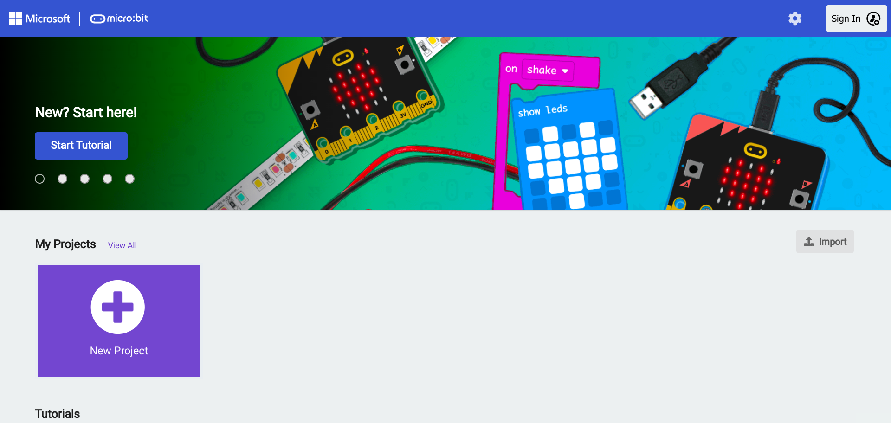
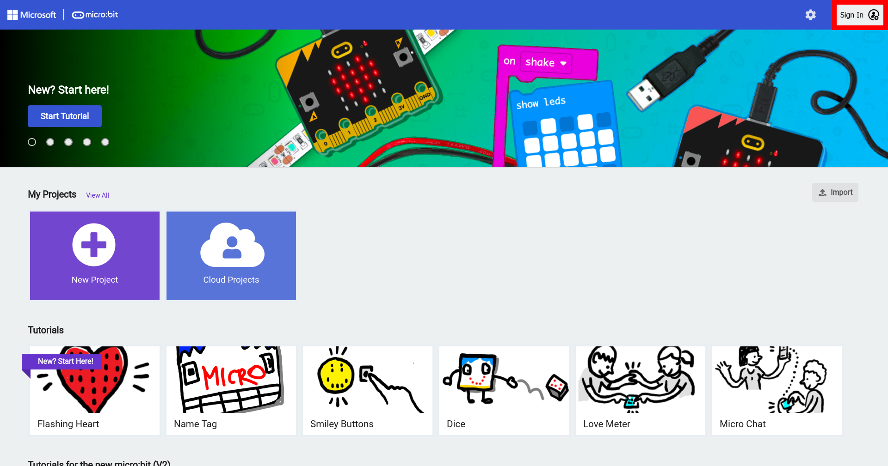
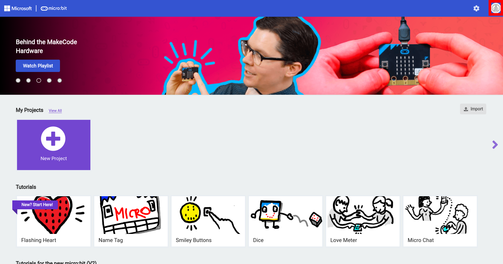

# The MakeCode Editor

The [MakeCode Editor for micro:bit](https://makecode.microbit.org/) is a block based programming environment developed by Microsoft.

```{note}
There are two versions of the MakeCode editor. One is specifically used for micro:bit: https://makecode.microbit.org/

There is also a version of the MakeCode editor that is used to create arcade games. This version does not have the blocks to control the micro:bit unless it is a micro:bit arcade device.

```



## Signing Into MakeCode

It is possible to use MakeCode without signing in, but projects may be deleted after a while or disappear if the browser history is cleared. To sign in, click on the "Sign In" button in the upper right corner:



A pop-up window will appear to enter your credentials. Use the proper service as indicated by the instructor.


After signing in, the "Sign In" button will change to display the picture associated with your email account. Once signed in, your projects will be saved automatically.

 

---

## Parts of the MakeCode Editor

The various parts of the MakeCode Editor are labeled below:


|      | Area/Button           | Description                                                  |
| ---- | --------------------- | ------------------------------------------------------------ |
| 1    | MakeCode Editor       | This is where blocks are placed from the Toolbox. These blocks will be executed and transferred to the micro:bit using the "Download" button. |
| 2    | Toolbox               | All blocks needed to code the micro:bit are divided into categories and color-coded to match each category in the toolbox. |
| 3    | micro:bit Simulator   | When code blocks are placed in the MakeCode Editor from the Toolbox, the simulator displays what the program does on the micro:bit simulator. The simulator will refresh automatically when the code is changed. It is possible to stop, refresh, and debug the simulator. There are also buttons to take screenshots of the simulator and display the simulator in full-screen mode. |
| 4    | Download Button       | The download button has two parts. The part on the left labeled "Download" downloads the code to the micro:bit after it has been paired with the computer. The part on the right with three dots connects or pairs the micro:bit and disconnects it. |
| 5    | Project Title         | This is where the project title can be changed. Files downloaded to be saved on the computer will be named according to the text in this field. |
| 6    | Home Button           | The home button navigates the user to the start screen, displaying the latest active projects. |
| 7    | Share Button          | This button generates links for others to view the project.  |
| 8    | Help Button           | This button opens a tour to the MakeCode editor, opens the support page for micro:bit, and has documentation for the hardware and the blocks. |
| 9    | Settings Button       | The settings button has many options for changing the project's settings. Extensions can be added from this button. The settings button also has options to delete the project or view different versions of the project. |
| 10   | Sign In Button        | This button allows users to save projects on the cloud. MakeCode users can log in using Microsoft, Google, or Clever accounts. |
| 11   | Undo and Redo Buttons | These buttons undo or redo the last actions. This can be useful if a mistake is made. |
| 12   | Zoom Buttons          | The zoom buttons allow users to zoom in and out of the editor, making blocks larger or smaller on the screen. |


```{note}
In order to save work indefinitly students must sign into the editor. Work may be saved for a short period of time without signing in, but projects will disappear at some point.
```


