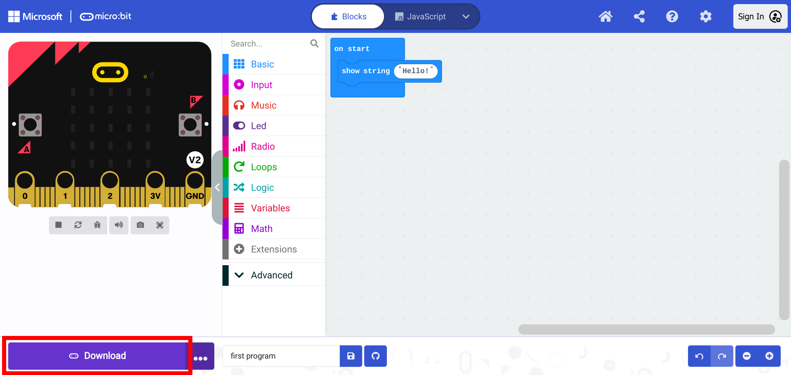
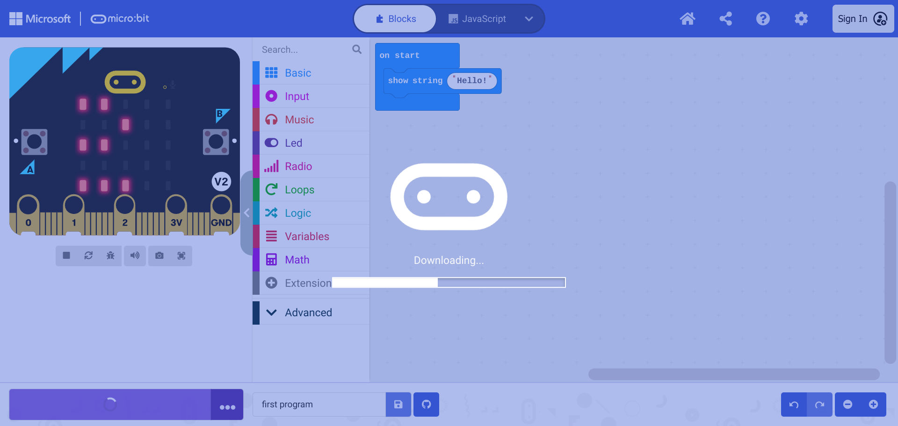

# Running Code on a micro:bit with MakeCode

The code in this section describes how to create your first program. The program displays the text "Hello!" and displays it on the micro:bit display once.

## Selecting and Adding Blocks

Click on the `Basic` section of the Toolbox.

Select the `show string` block. A string is a group of characters that can include letters, numbers, symbols, and even spaces. Strings are mainly used to store text people can read, like words and sentences. They help computer programs communicate information to the person using the program.

Drag the `show string` block into the `on start` block. Pay close attention to the shape of the blocks. They need the same shape to "click" together and make your code work correctly.

The program is now complete. Click run and watch your micro:bit display your message. Now replace ‘hello’ with another word and run the code. Did it work?

## Handling Unused Blocks

Unused blocks can be moved or deleted. Even if they are empty, unused blocks do not generally affect the program, but moving or deleting unused blocks prevents overlapping blocks and improves the code's readability.

### Moving Unused Blocks

Unused blocks can be selected and moved.

### Deleting Unused Blocks

Unused blocks can be deleted by dragging them to the left and releasing them on the Toolbox where the purple trash appears.

Unused blocks can also be deleted by selecting the block and pressing the delete or backspace key on the upper right corner of the keyboard.

## Downloading Code to the micro:bit

After the `show string` block is placed in the `on start` block, it can be downloaded to the micro:bit. If the micro:bit is not connected, follow the steps in the previous section.

After the "Download" button is pressed, it is downloaded to the micro:bit.

