# Variables

## What is a variable?

In computer science, a **variable** is like a container that holds information. This information can be a number, a word, or something else. For example, if you’re writing a game, you might have a variable to keep track of the player’s score. Every time the player scores a point, the computer changes the number in that variable. Variables help computers remember things while running a program, making it possible to do all kinds of tasks, like simple math, keeping track of a game’s progress, or storing sensor data.

To create a variable, select "Variables" in the Toolbox.

Click on "Make a Variable".

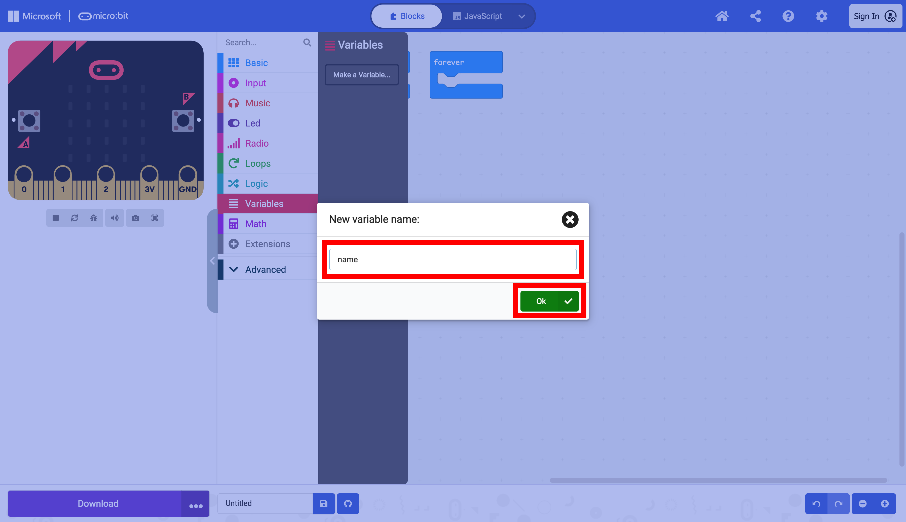

A window will appear with a text box and on "Ok" button.

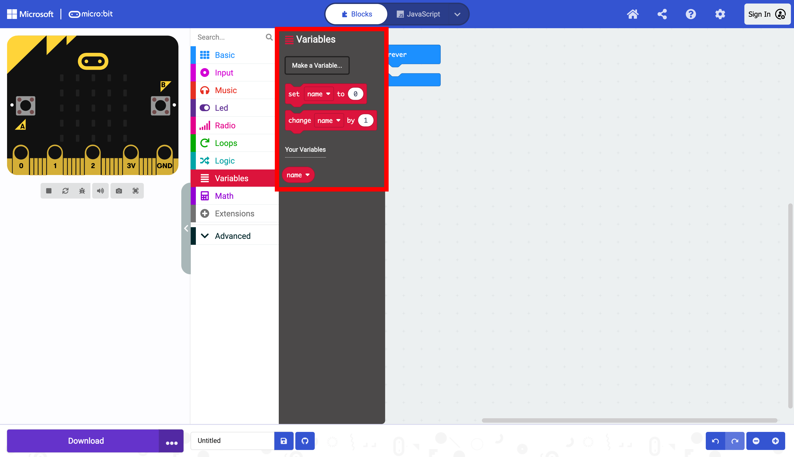

Enter your "name" and the new variable name, and press "Ok".

A new set of blocks related to the variable you created will appear.

Select the `set` block.

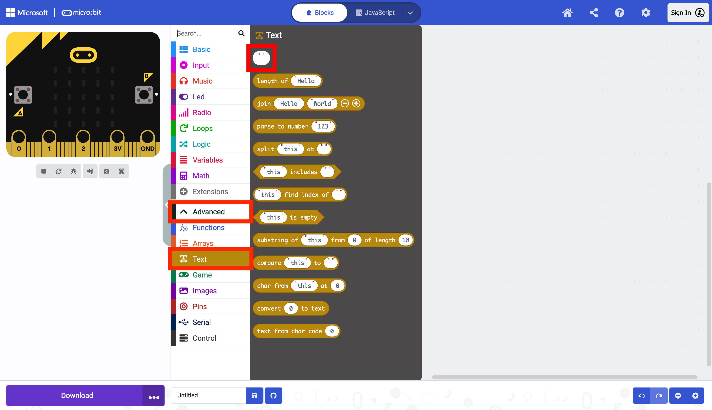

Place the `set` box in the `forever` block. 

Move the `forever` block.

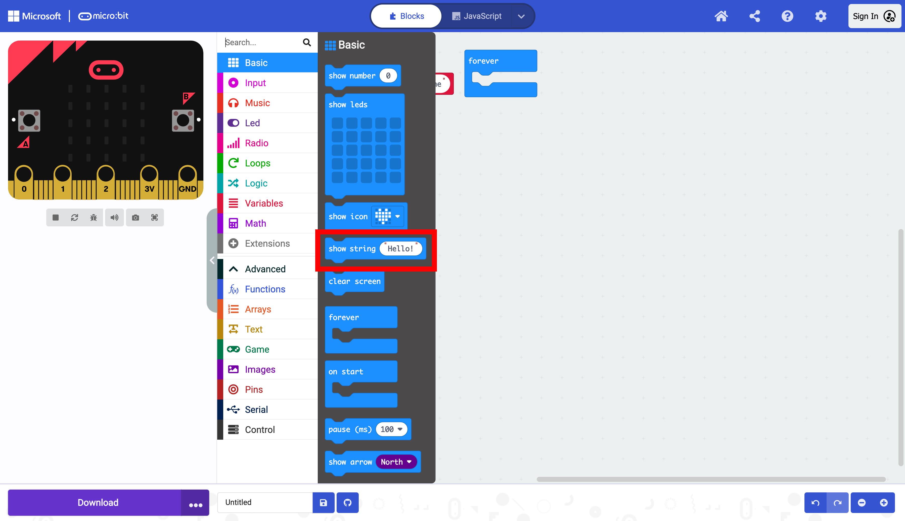

It is now visible without obstruction.

You now need to add a string to the oval with a `0`. Select "Advanced" in the Toolbox.

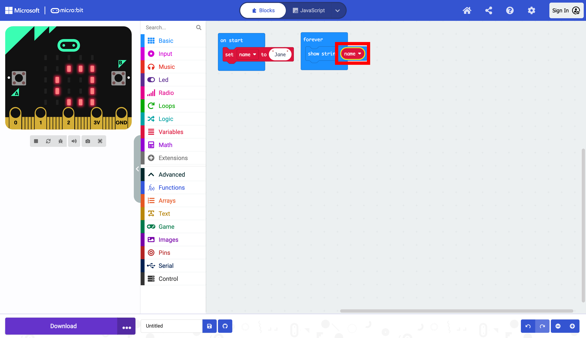

Next, click on "Text" to see the blocks that are used for strings.

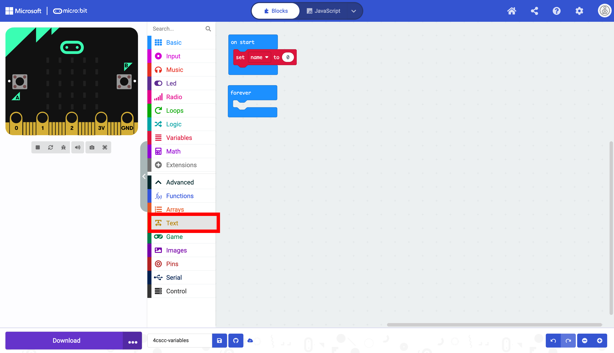

Select the empty string  `" "` block.

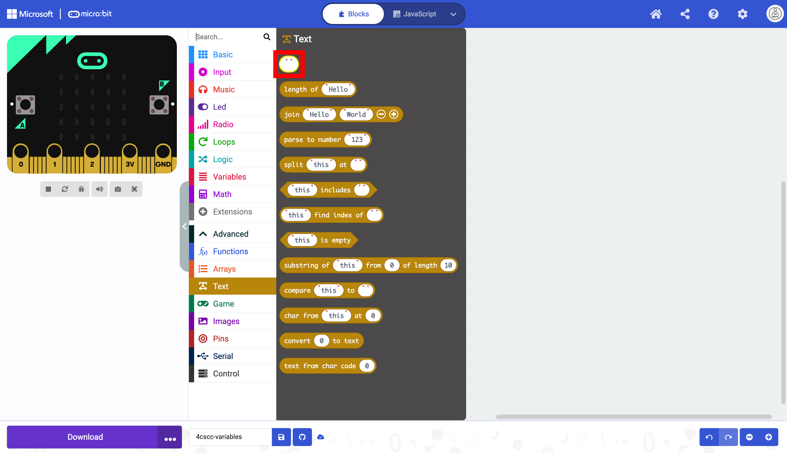

Place the empty string `" "` block in the oval in the `set` block. Change the string to your name.

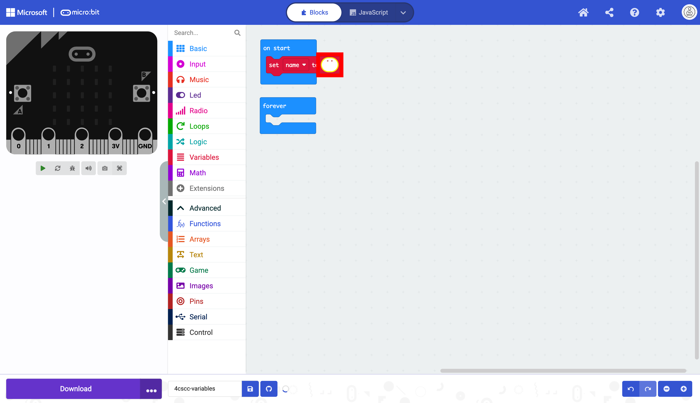

Now click on the "Basic" drawer of the Toolbox.

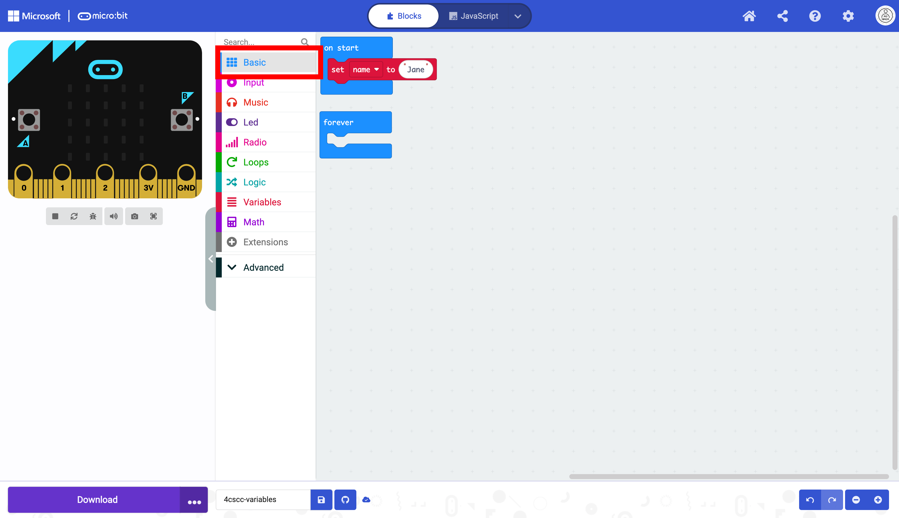

Select the `show string` block.

Drag the `show string` block into the `forever` block.

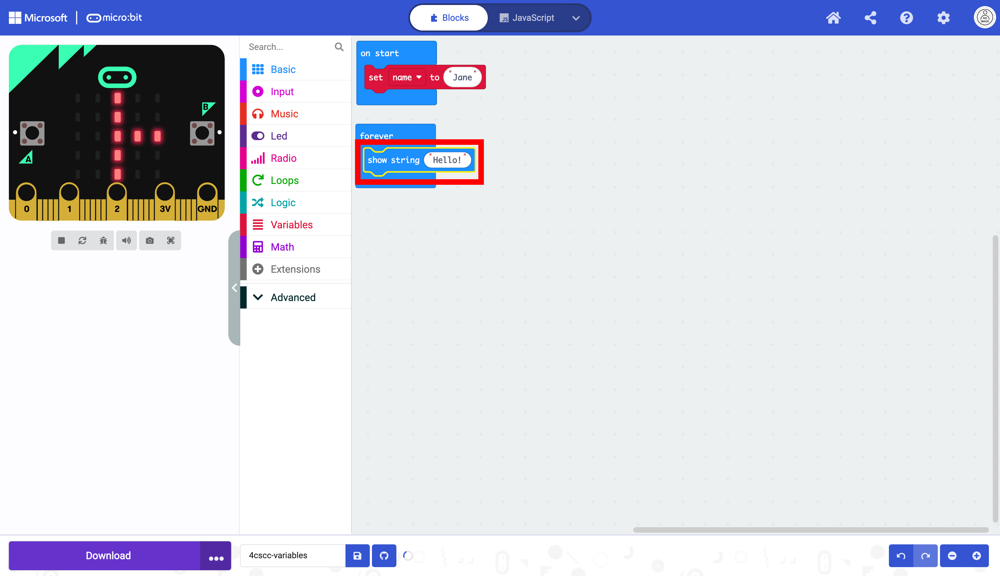

Click on the "Variables" drawer of the Toolbox.

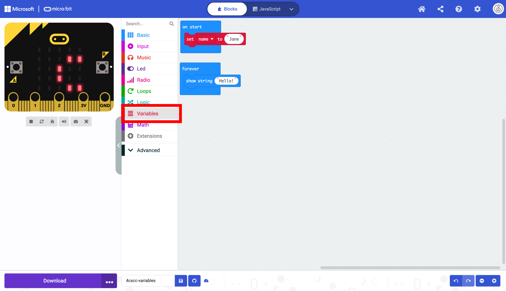

Select the variable `name`

Place the variable block `name` in the `show string` block.

The code is now ready to be flashed on the micro:bit.
