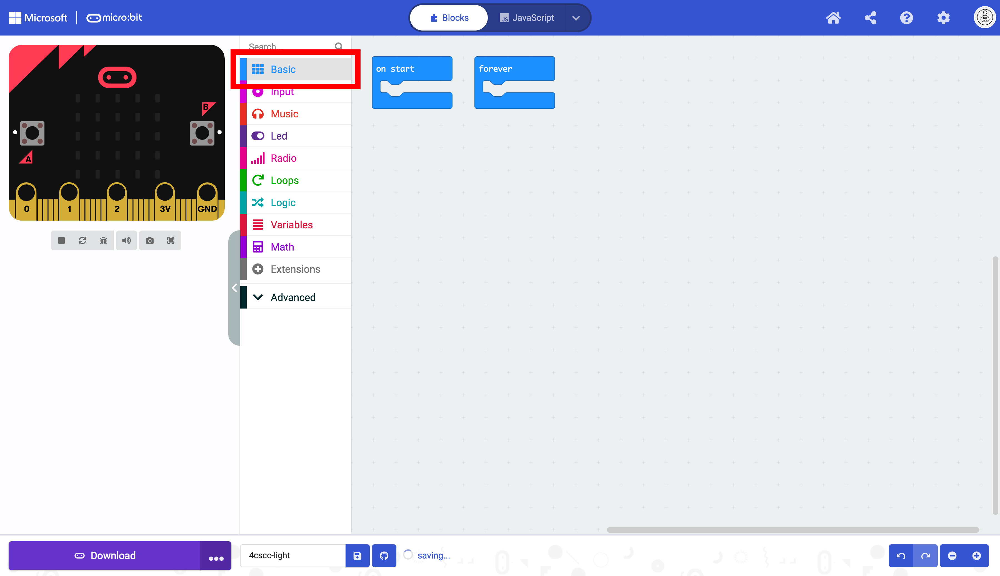
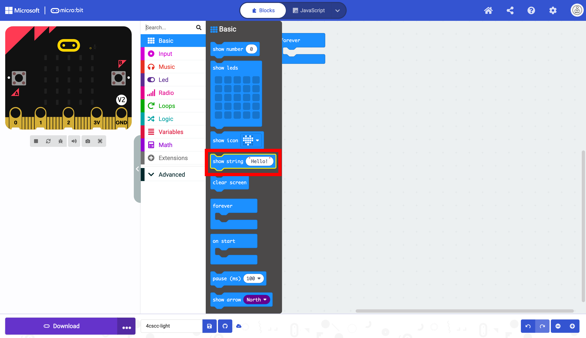
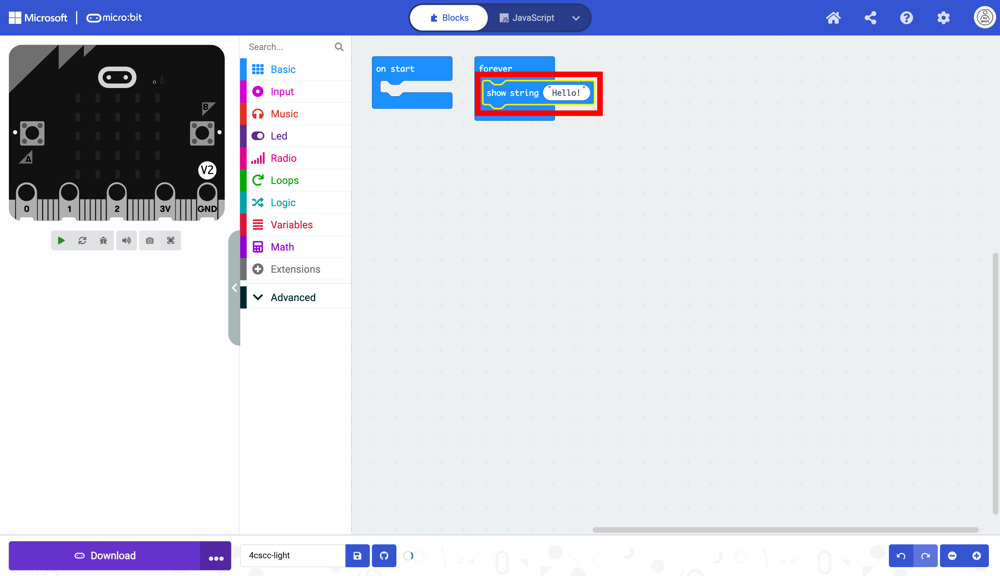
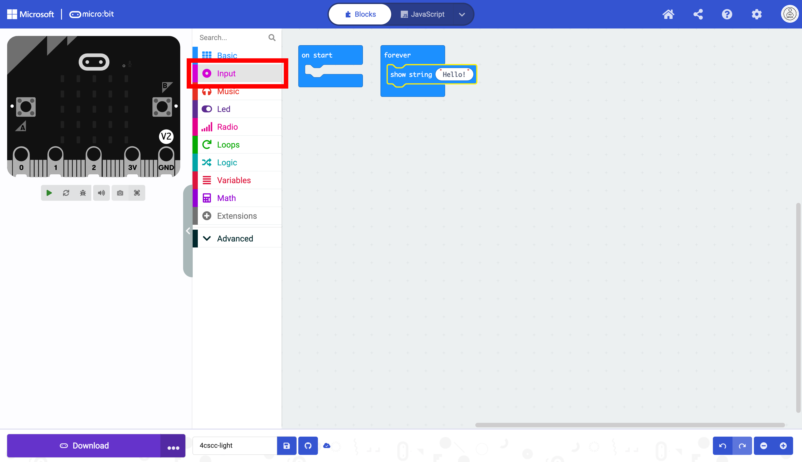
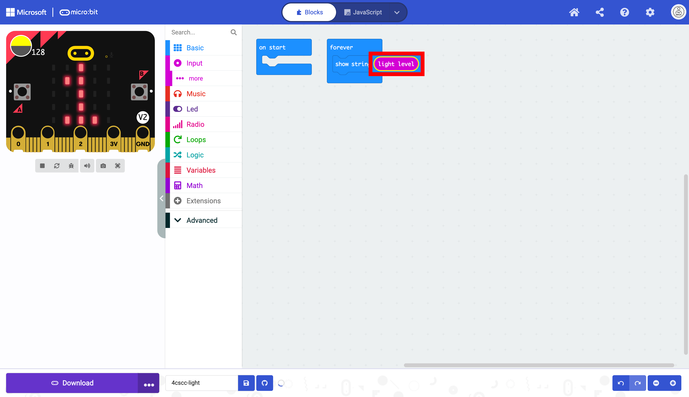

# Using the Light Sensor

This section will focus on the micro: bit's light-sensing capabilities. The micro:bit has no dedicated light sensor, but the LED display can act like a primitive light sensor.

To display the light level, we first need to add a string representing the value returned by the sensor. To do so, click on the "Basic" drawer in the Toolbox.

Select the `show string` block.

Place the `show string` block in the `forever block.`

Next you need to get the block that reads the light level. Click on the "Input" drawer of the Toolbox.

Select the `light level` block.

Place the `light level` block in the `show string` block.

The code is now ready to be flashed on the micro:bit.
