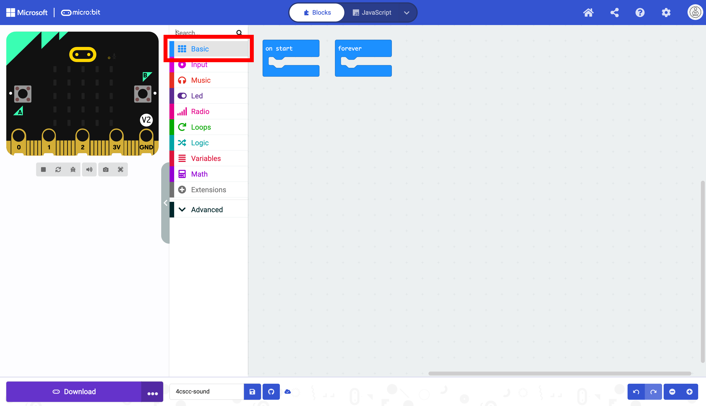
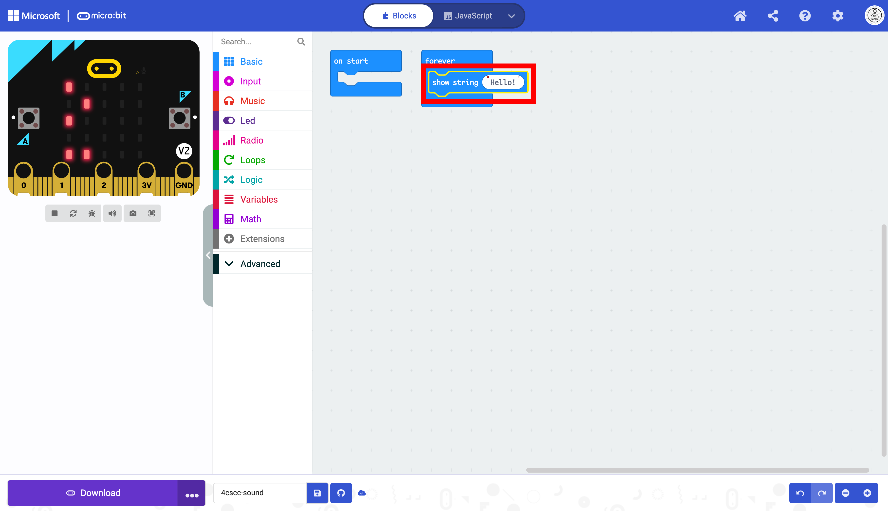
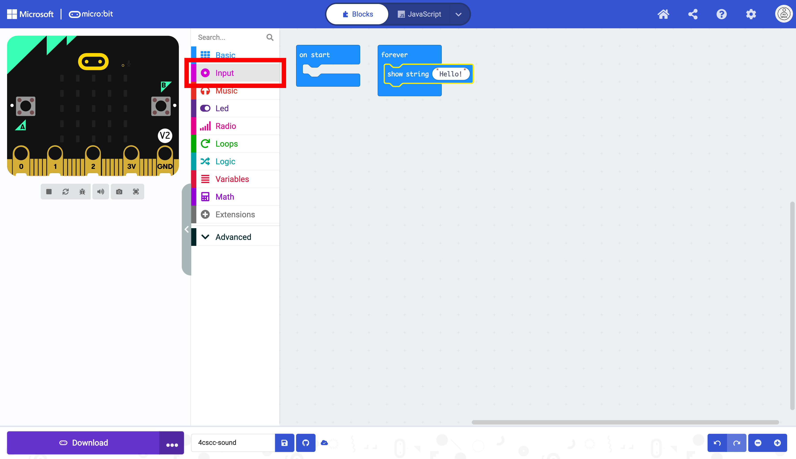
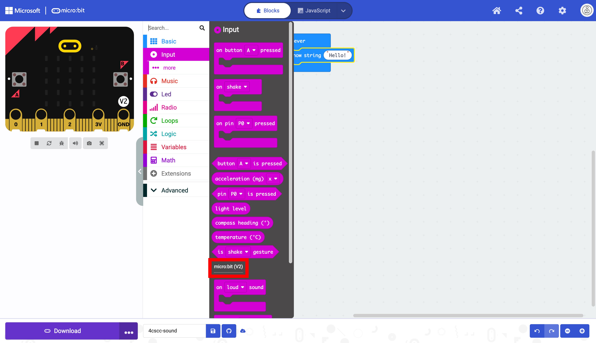
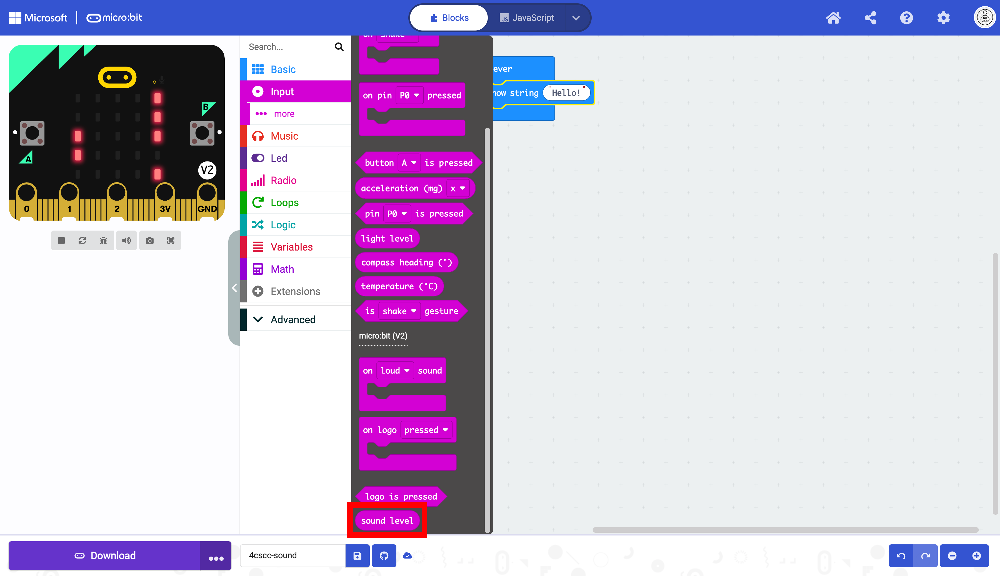

# Using the Microphone

In this section, you will learn to use the sound-sensing capabilities of the micro:bit. 

To display the sound level, we first need to add a string representing the value returned by the sensor. To do so, click on the "Basic" drawer in the Toolbox.

Select the `show string` block.

Place the `show string` block in the `forever` block.

Next you need to get the block that reads the sound level. Click on the "Input" drawer of the Toolbox.

Scroll down to the section that has the "micro:bit (V2)" blocks.

Select the `sound level` block.

Place the `sound level` block in the `forever` block.

The micro:bit is now ready to be flashed with code. Press the download button to transfer the code to the micro:bit.
