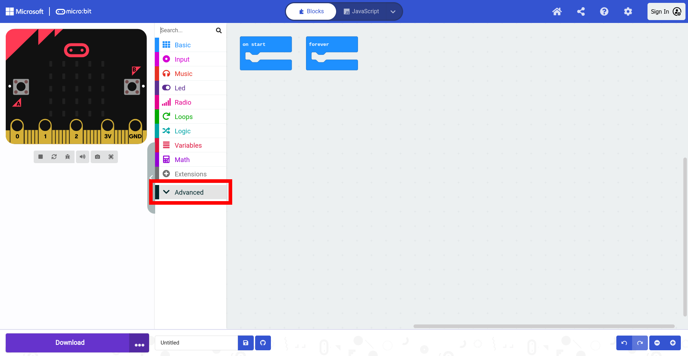
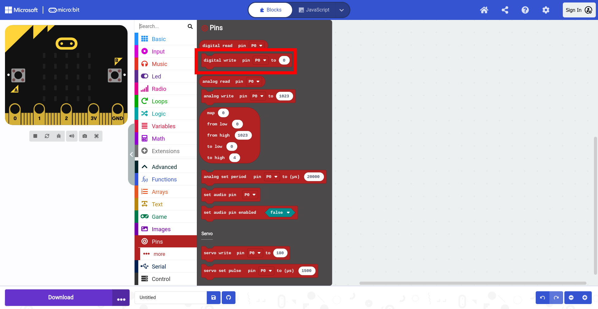
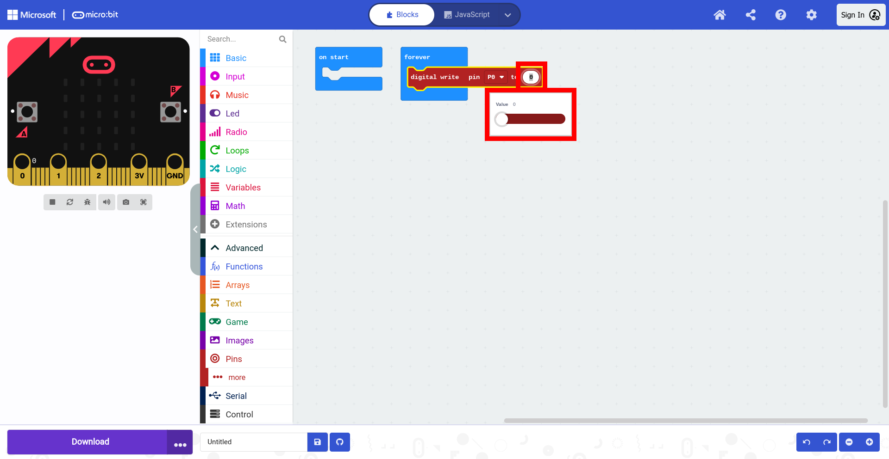
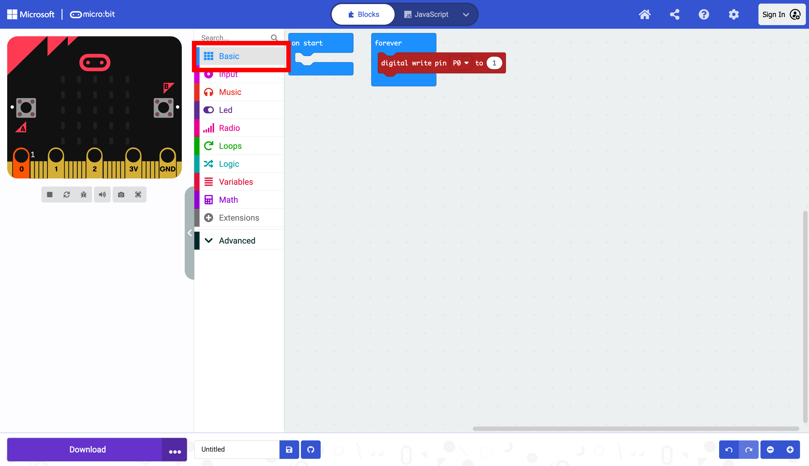
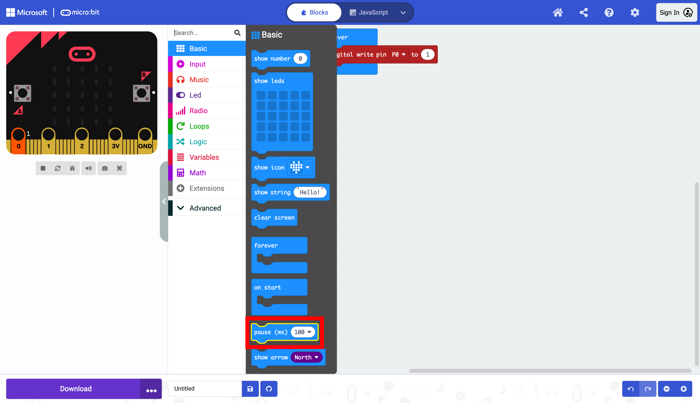
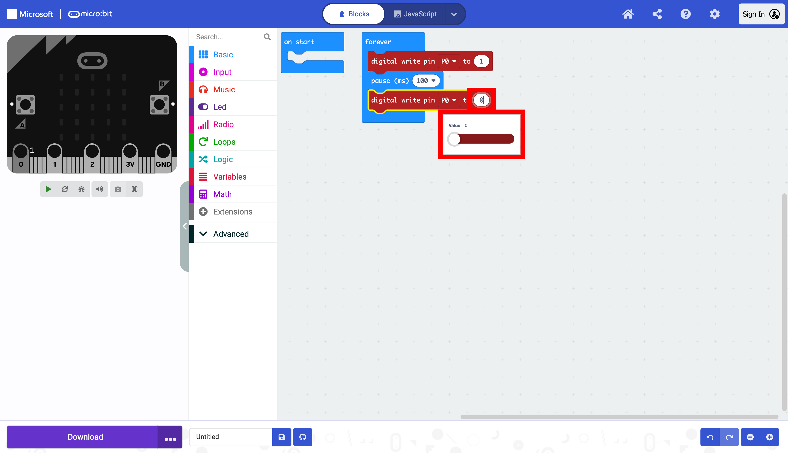
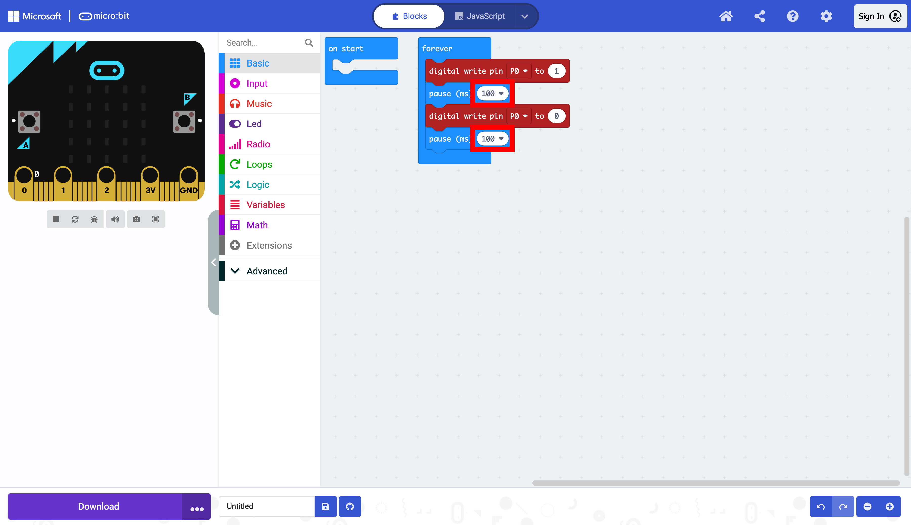
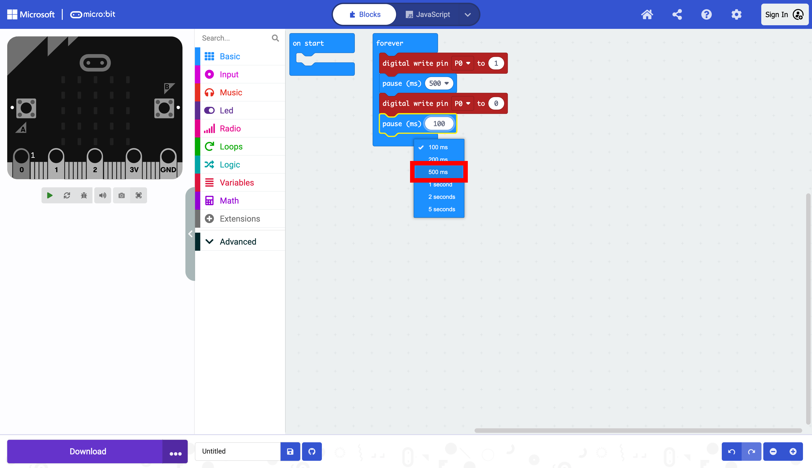

# Blinking an LED

Now that you know about breadboards and resistors and have built a basic circuit with an LED and the micro:bit, it is time to make the LED blink.

Open [MakeCode](https://makecode.microbit.org/) and create a new project.

Select the Advanced drawer in the Toolbox.

Select the `digital write` block.

Insert the `digital write` block into the forever block. You can change the value by typing a value or using the slider. A value of `0` means the digital signal will be off, and a value of `1` means the digital signal will be on. This is what will make the LED blink. The pin is set to `P0` and does not need to be changed, because the LED is connected to `0` on the  Kitronik prototyping plate.

Change the value to `1` to turn the LED on.

Next, select the Basic drawer in the Toolbox.

Select the `pause` block.

Place the `pause` block in the `forever` block below the `digital write` block.

Duplicate the `digital write` block.

The duplicated block appaears over the original blocks. .Select the duplicated `digital write` block.

Place it below the `pause` block in the forever block.

Change the value from `1` to `0`.

Duplicate the `pause` block.

Select the duplicated `pause` block.

Place the duplicated `pause` block below the second `digital write` block.

Notice that the default value is 100. MakeCode measures time in **milliseconds** (ms), and 1000 ms is equal to one second. The default value of 100 is 0.10 (one-tenth) of a second, which will cause the LED to blink 5 times (on and off) in a second. Let's change this value to change the blinking rate.

To make the LED blink once (on and off) in a second, change the value from `100` to `500`.

Change the value in the other `pause` block from `100` to `500`.

Now both values are `500` code will turn the LED on for half a second and turn the LED off for half a second.

The program is now complete. The LED should be turning on and off every second.

Try experimenting with different blink rates by changing the value in the `delay` block.

A complete project can be opened below:

<iframe style="position:absolute;top:0;left:0;width:100%;height:100%;" src="https://makecode.microbit.org/#pub:S26992-28437-70952-61986" frameborder="0" sandbox="allow-popups allow-forms allow-scripts allow-same-origin"></iframe>

