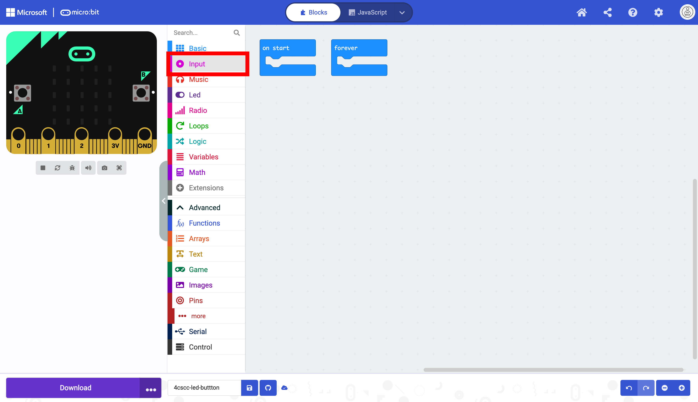
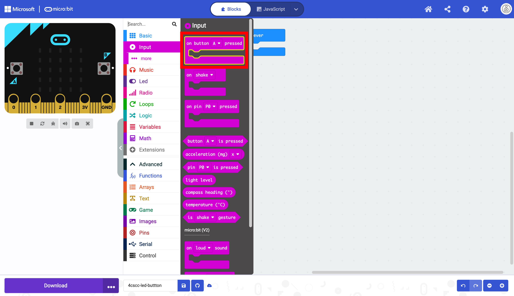
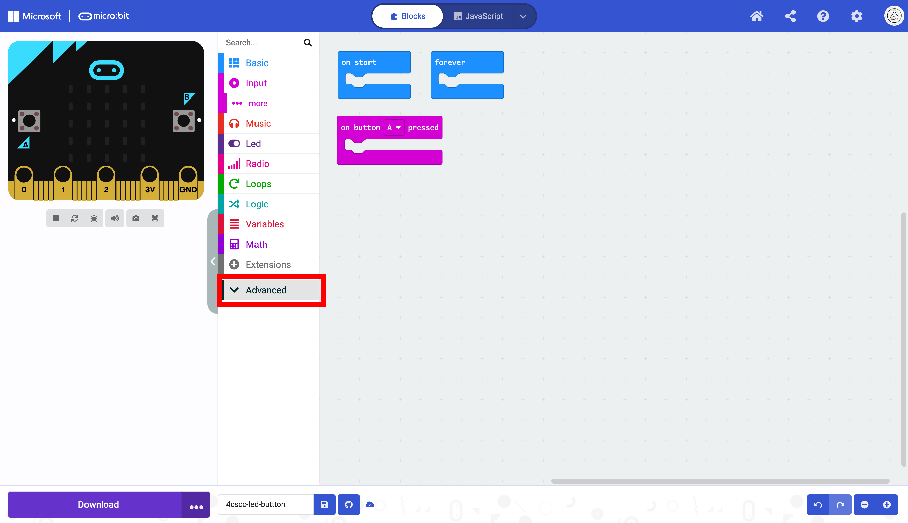
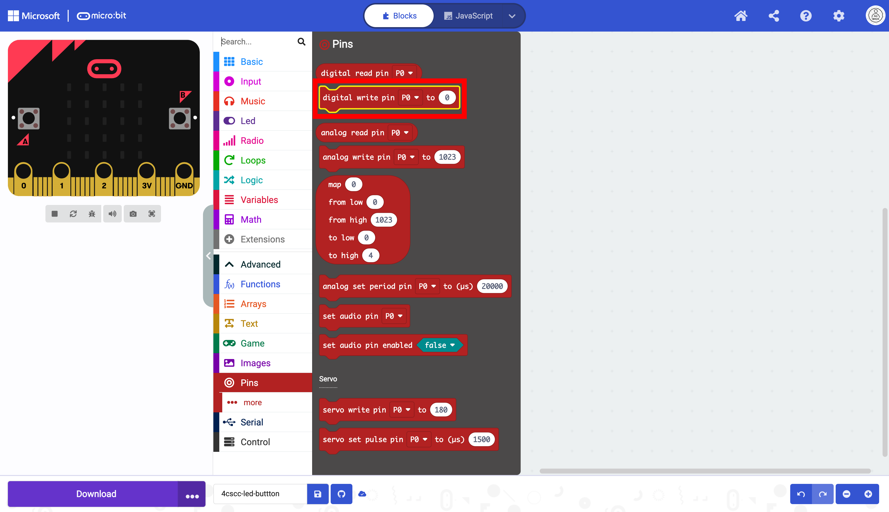
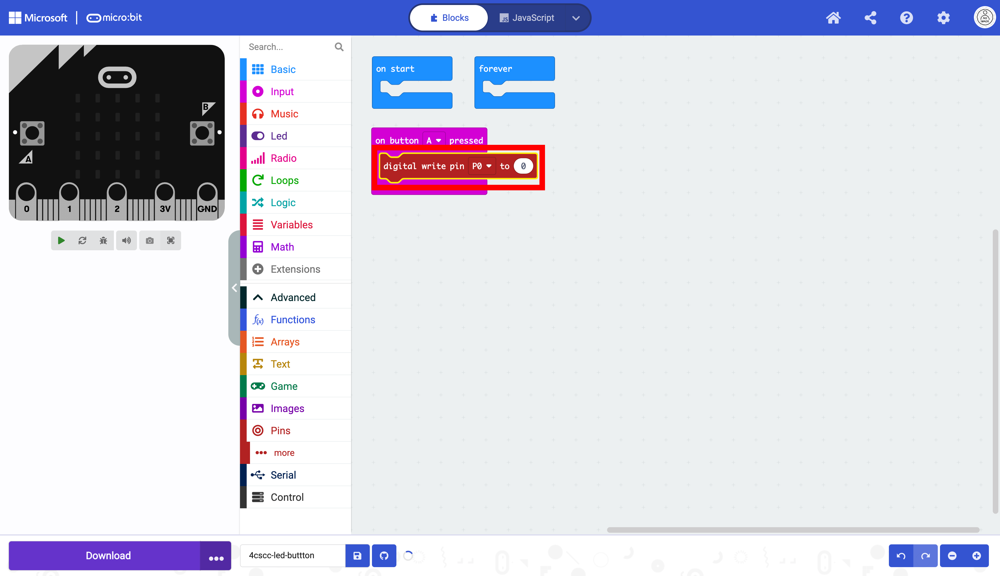
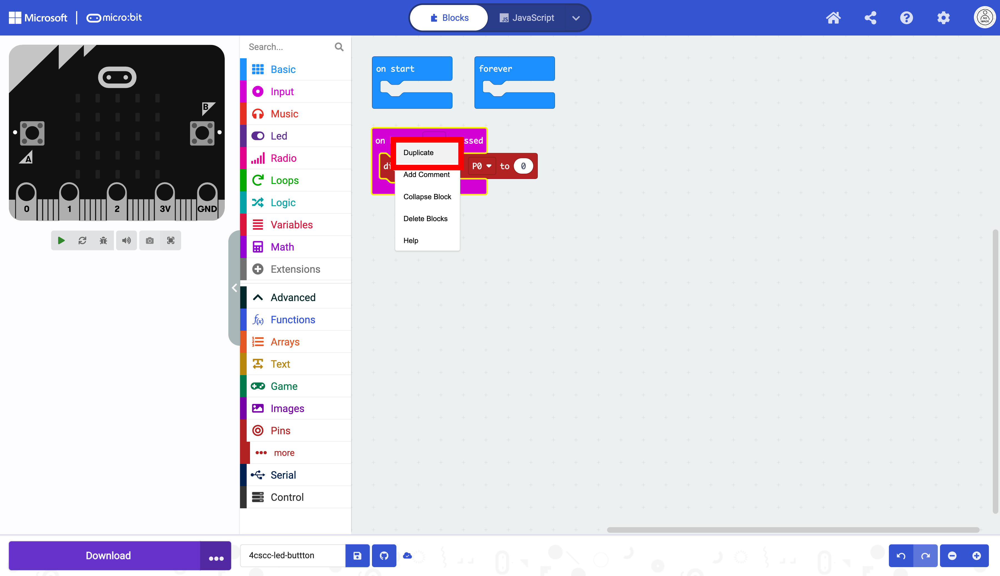
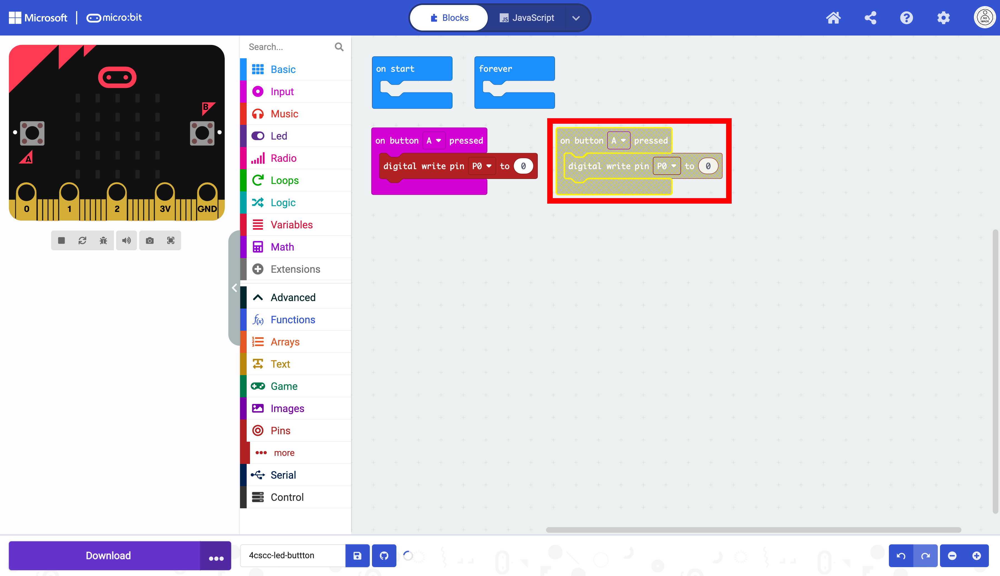
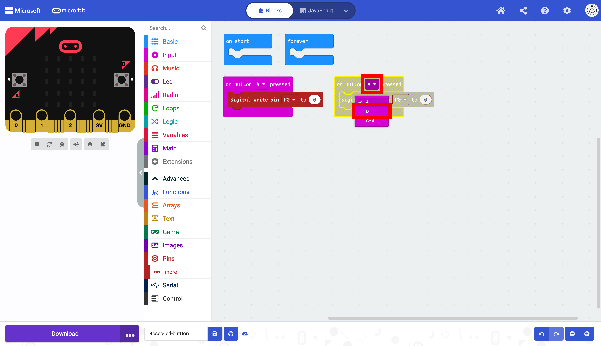
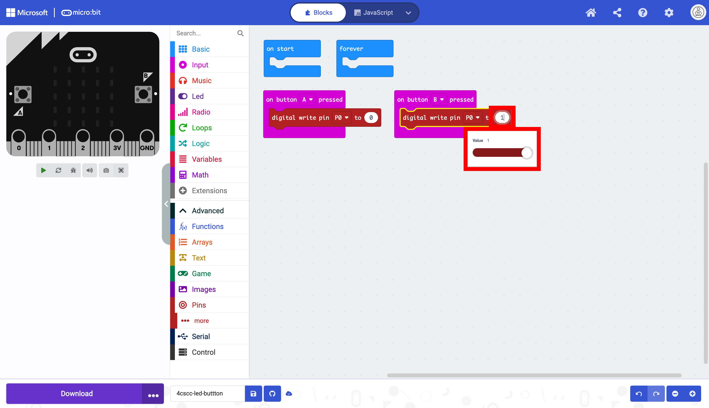

# Using a Button and an LED 

Open [MakeCode](https://makecode.microbit.org/) and create a new project.

First, we need to add a button. Select the Input drawer on in the Toolbox.

Drag the `on button` block onto the workspace.

This is a special block that does not need to be placed into the `on start` or `forever` blocks. In fact, the shape of the block will not allow you to place it in these blocks.

Select Advanced.

Then select Pins.

Select the `digital write` block.

Place the `digital write` block in the `on button` block.

Duplicate the `on button` block. Make sure that you are duplicating the `on button` block and not the `digital write` block.

The duplicated block is over the duplicated block.

Move the new block to the side. Notice how the block is a different color than the other block. This is because the code is the same, and MakeCode will ignore duplicated blocks.

Toggle the `A` on the `on button` block and select `B`. This will change the code to react to button `B` instead of button `A`.

The block is now the same colors as the other `on button` block,

This code will not turn the LED on and off, because both of the values in the blocks are `0`. This code will only keep an LED off or at `0`. The value in the `on button b` block must be changed.

Change the digital signal from `0` to `1`.

The program is now complete, and button `A` should turn the LED off and button `B` will turn the LED on. 

Try switching the values so button `A` turns the LED on and button `B` turns the LED off.

A complete project can be opened below:

<iframe style="position:absolute;top:0;left:0;width:100%;height:100%;" src="https://makecode.microbit.org/#pub:S98260-52711-92823-36690" frameborder="0" sandbox="allow-popups allow-forms allow-scripts allow-same-origin"></iframe>
