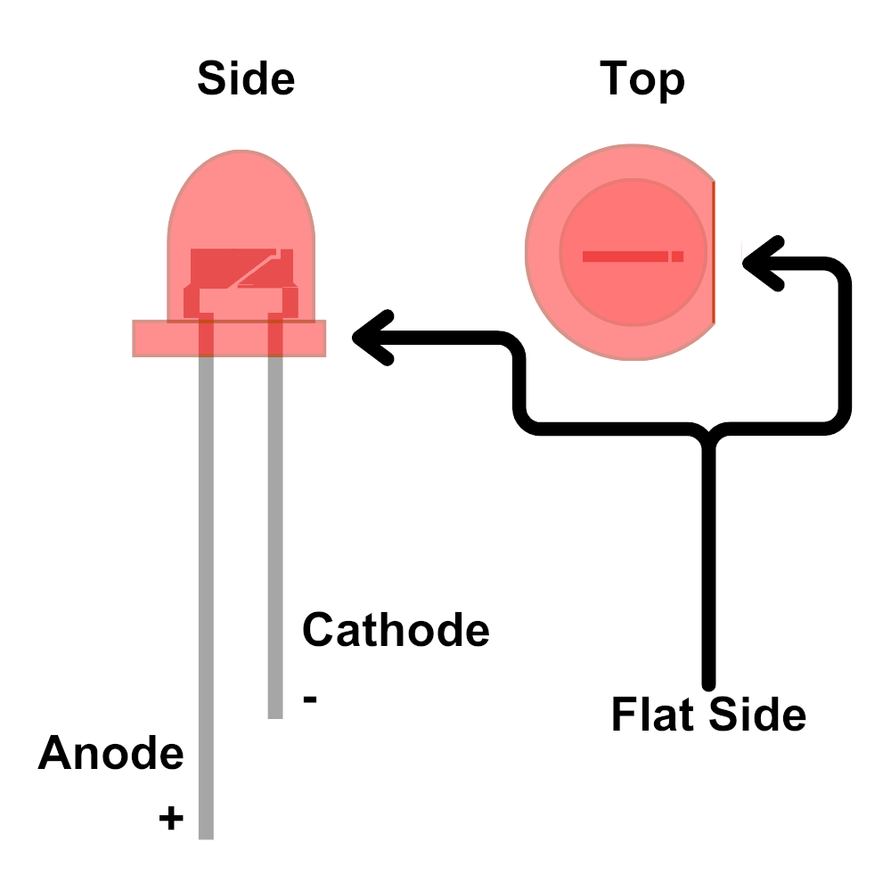
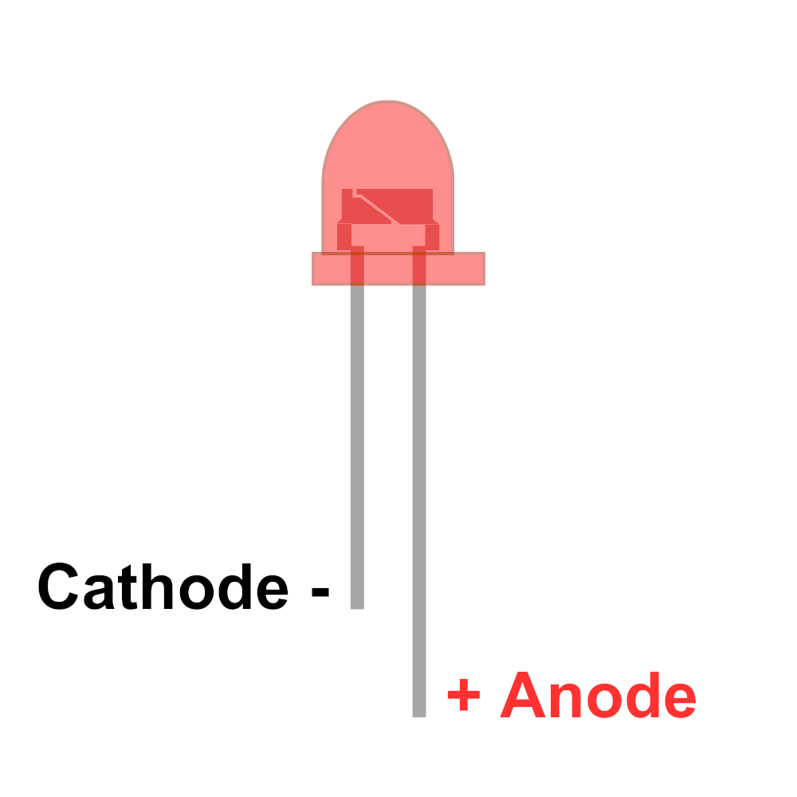

# Light-Emitting Diodes?

## What is an LED?

In this lesson, students will delve deeper into the onboard components of the BBC microbit. Building on previous experiences with the device, this exploration will comprehensively understand its various built-in features. Students will examine the microbit’s LED matrix, accelerometer, magnetometer, buttons, and radio module. Understanding these components is essential for leveraging the microbit’s full potential in creative and practical applications. The lesson will combine theoretical knowledge with hands-on activities, enabling students to see firsthand how each component functions and interacts with the others. Through this detailed exploration, students will gain the skills needed to design and implement more complex projects using the BBC microbit.



LEDs are diodes. A diode is an electronic component that acts like a one-way street for electricity. It only lets electric current flow in one direction and stops it from going the other way. Think of it like a valve or a gate that only opens in one direction. An LED will not illuminate if the anode (longer positive leg) is connected to the ground.

The anode is the **positive terminal**, connected to the longer leg of the LED (usually indicated by a notch on the LED casing).

The cathode is the **negative terminal**, connected to the shorter leg (usually indicated by a flat edge on the LED casing).

## Checkpoint: Anode or Cathode

Which lead is the anode? Which lead is the cathode? What is the polarity of the different leads?


```{admonition} Click here to reveal the solutions.
:class: dropdown
Solution:


**A** has the flat side and the shorter lead so it is the **cathode**. The polarity is **negative**.<br>
**B** has the longer lead so it is the **anode**. The polarity is **positive**. 