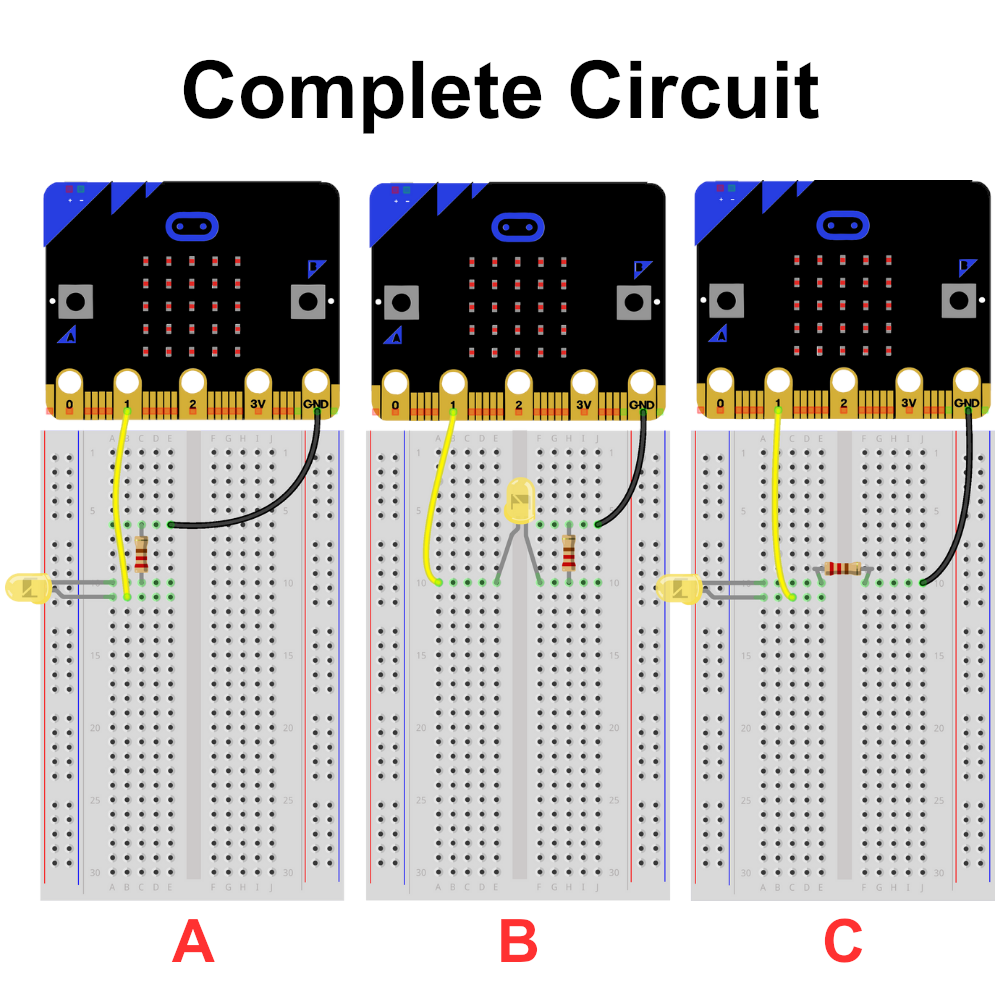
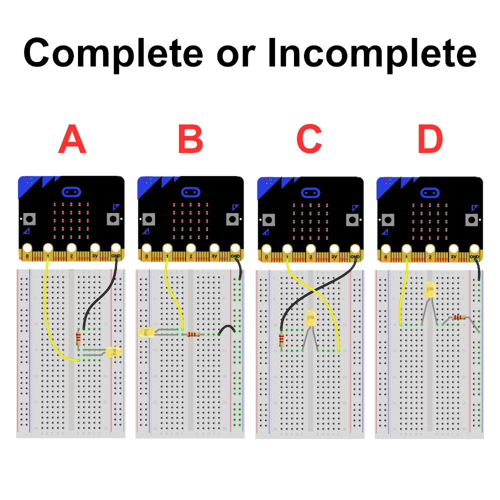

# Complete and Incomplete Circuits

## Complete Circuit

A **complete circuit** is like a full loop or pathway that allows electricity to flow from a power source through various lights or motors) components (like and back to the power source. Imagine it as a circle where the electricity can travel around and around without any breaks. For example, if you connect a power source to a lLED with wires in a complete loop, the LED will light up. 

Here are some examples of complete circuits:



## Incomplete Circuit

On the other hand, an **incomplete circuit** has a break or gap in the loop, so the electricity can’t flow all the way around. This is like a broken circle where the path is interrupted, so if there’s a gap in the wires or a switch is turned off, the LED won’t light up because the circuit is incomplete.


## Checkpoint: Complete or Incomplete

Which circuits are complete or incomplete?



```{admonition} Click here to reveal the solutions.
:class: dropdown
Solutions:

**A**: This is an incomplete circuit, because input/output pin is not connected to the same row the annode of the LED is connected to.<br>
**B**: This is an incomplete circuit, because the GND pin is not connected to the sane row as the jumper attached to the resistor.<br>
**C**: This is an incomplete circuit, because the annode is attached to the GND pin.<br>
**D**: This is a complete circuit.
```
