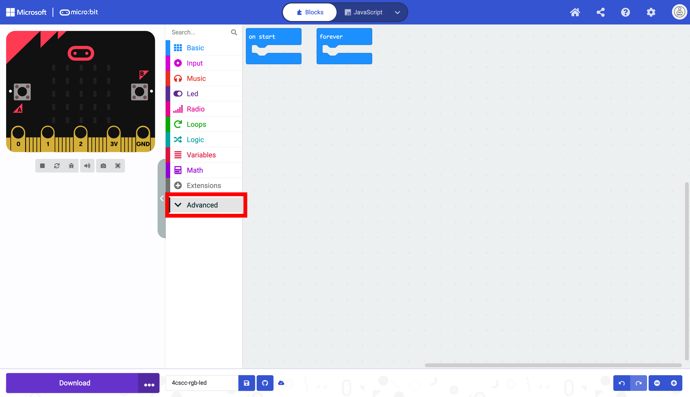
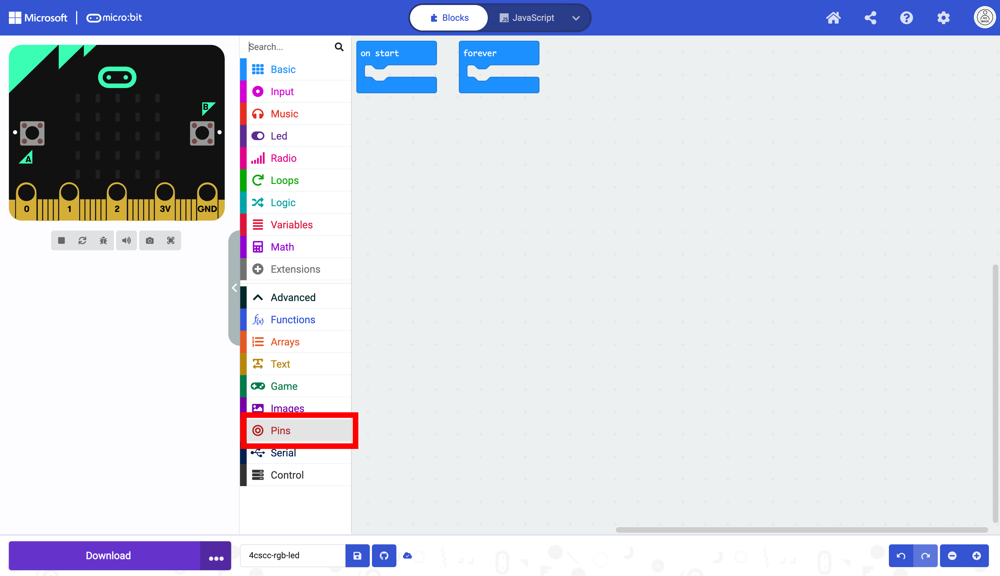
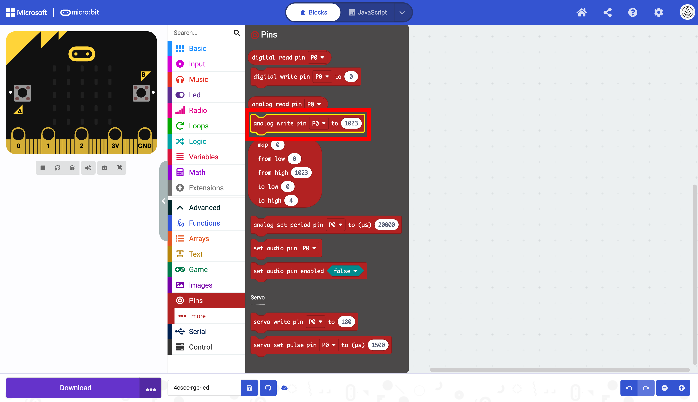
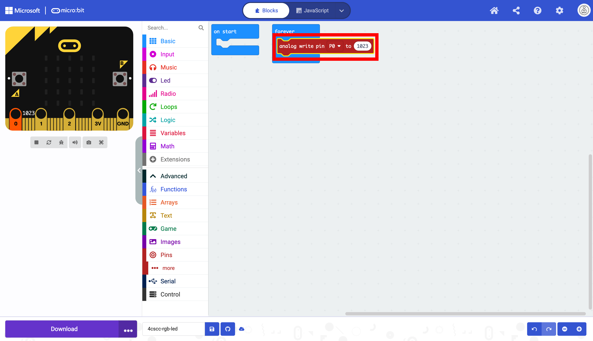
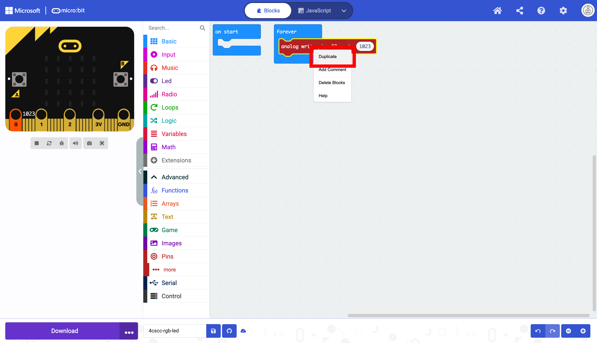
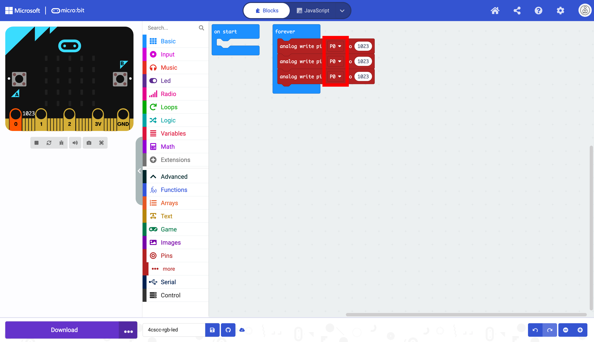
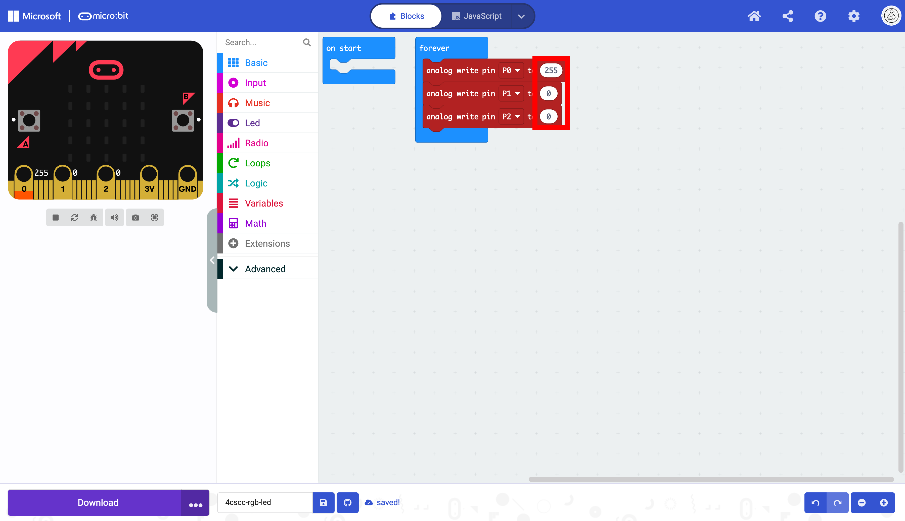
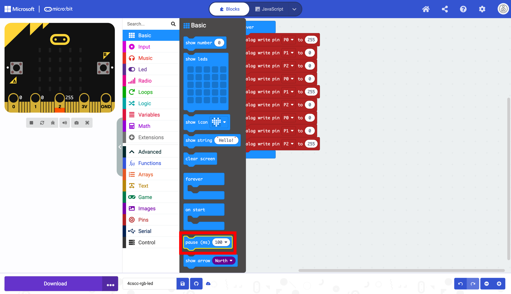
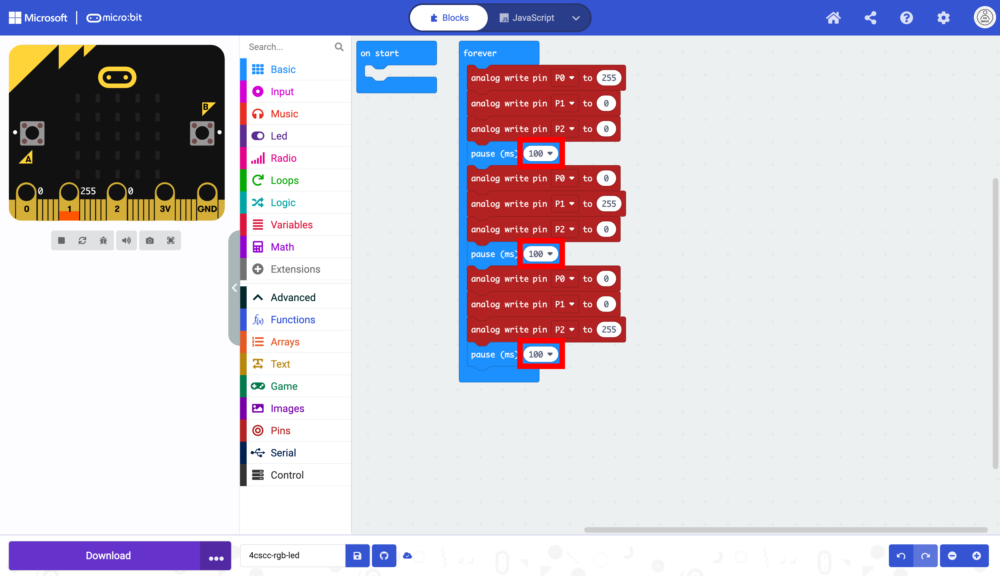

# Flashing Red, Green, and Blue

Select the "Advanced" drawer in the Toolbox. 

Click on the "Pins" drawer.

Select the `analog write` block.

Drag the `analog write` block into the `forever` block.

Right-click the `analog write` block and select "Duplicate."

Make two duplicates of the `analog write` box.

Place the duplicated `analog write` blocks in the forever loop.

You now need to change the pins to match the pins on the leads in the circuit built in the previous section. 

The red lead is attached to `0` or `P0` in MakeCode, the green is attached to `1` or `P1`, and the blue is attached to `2` or `P2` in MakeCode.

These values will represent the three leads of the RGB LED.

Changing the first value to `255` and the others to `0` will produce a red light. Duplicate these three blocks twice and place them in the `forever` block. 

Change the values to represent the three colors with the following:

- red being (255, 0, 0)
- green being (0, 255, 0)
- and blue being (0, 0, 255)

To make the less stay on we need to place `pause` blocks after each color. Select the "Basic" drawer in the Toolbox.

Select the `delay` block.

Place a `delay` block after every color.

The duration of the `delay` block can be changed. Remember that the `100` is 100 milliseconds or 0.10 seconds. 

The delay can be changed to make the colors alternate slower. 

This examples changes the color every `500` milliseconds or every half a second. 

The program is now complete. The LED should alternate red, green, and blue every half a second.
