# Using Functions to Alternate Colors

## What is a Function?

A function in programming is a set of instructions that performs a specific task. You can think of it like a mini-program within your larger program. When you use a function, you give it a name and tell it what to do, so whenever you need to perform that task, you just call the function by its name instead of writing the same code over and over again. This makes your code more organized and easier to read.

## Creating a Function in MakeCode

To create a function, select the "Advanced" drawer in the Toolbox.

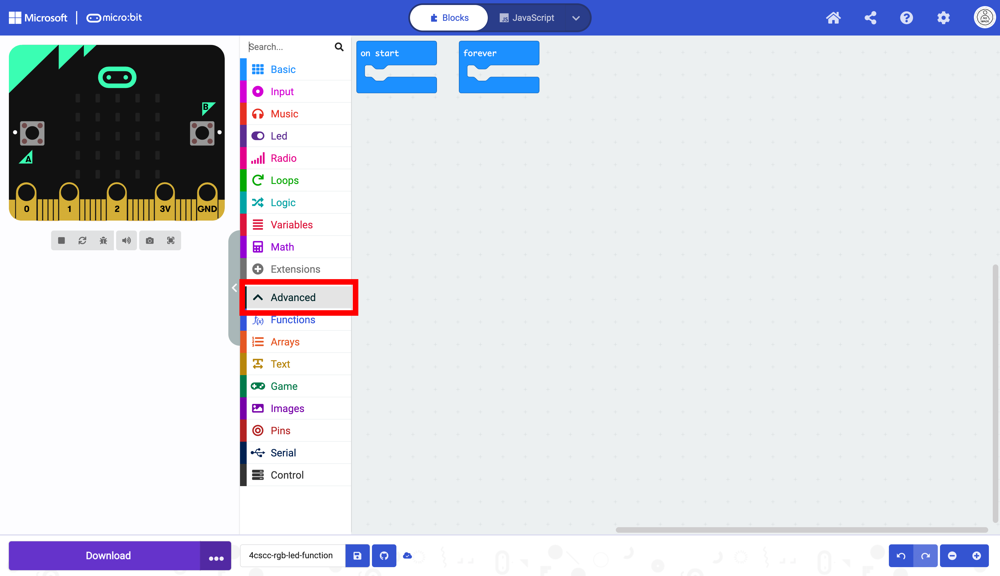

Select the "Functions" drawer.

Click on "Make a Function...".

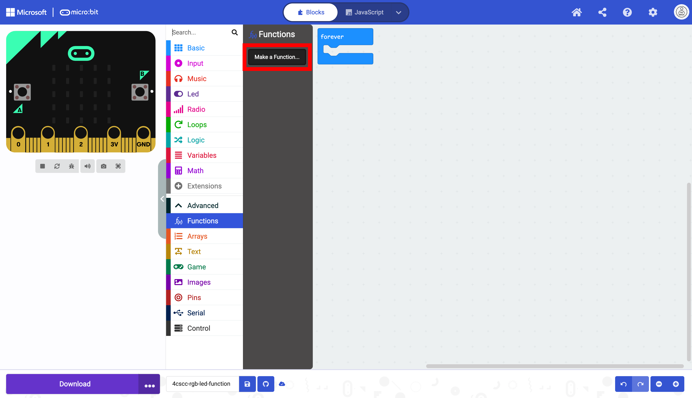

A new window will open to edit the new function.

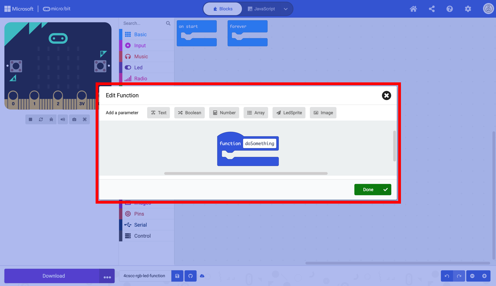

First, change the name of the function.

In this example, you will create a function called red that will have all the blocks to turn an RGB LED red. Change the name to "red" and click the "Done" button. 

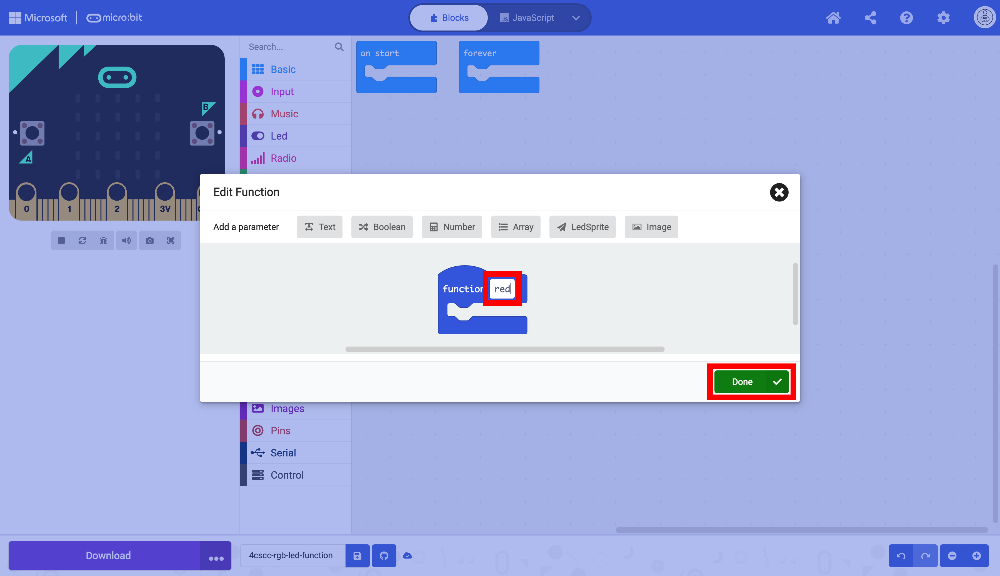

The empty function called "red" will be placed on the workspace.

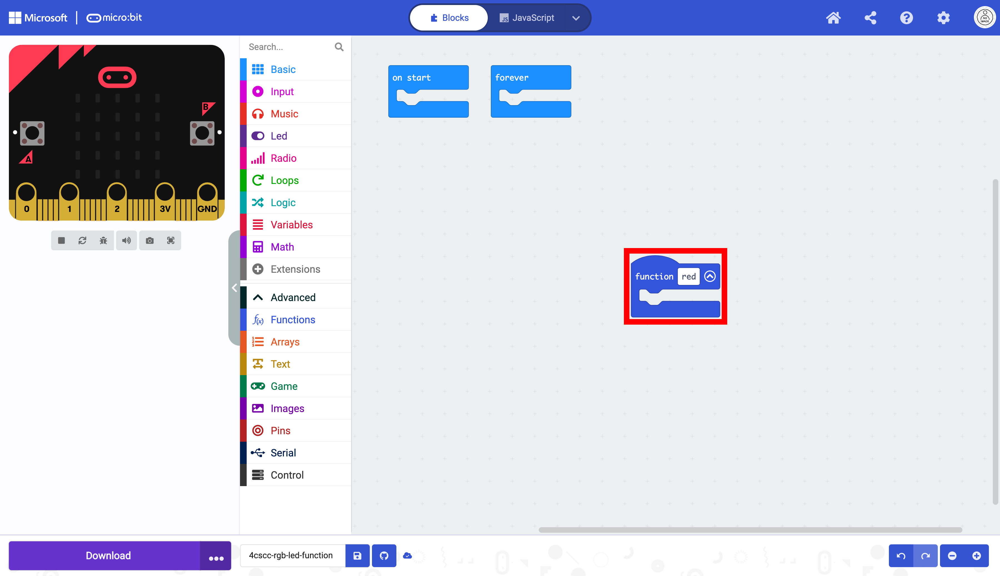

Rearrange the `red` function block to make space for more function blocks.

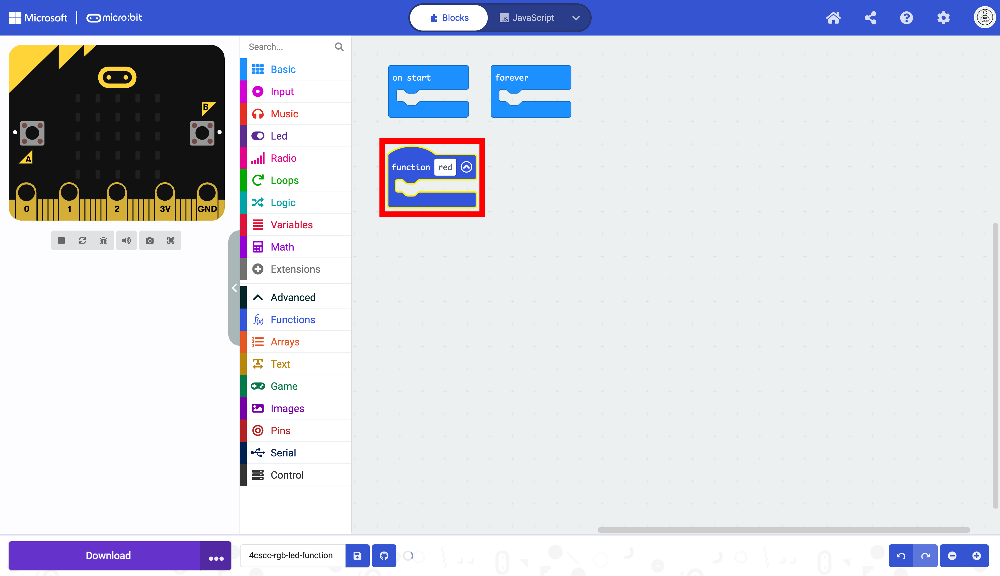

Select the "Pins" drawer in "Advanced". Select an `analog write` block.

Place the `analog write` block in the `red` function.

Duplicate the `analog write` block twice.

Place the two duplicated `analog write` blocks in the `red` function. Change the pins as in the previous lesson. Change the values to illuminate the RGB LED red (`255`, `0`, `0`).  

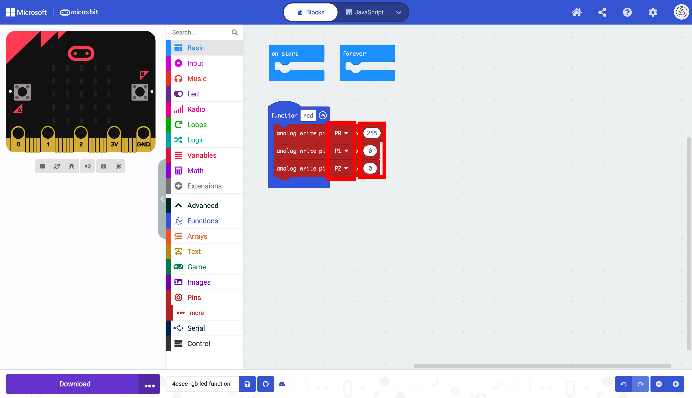

Duplicate the function block twice.

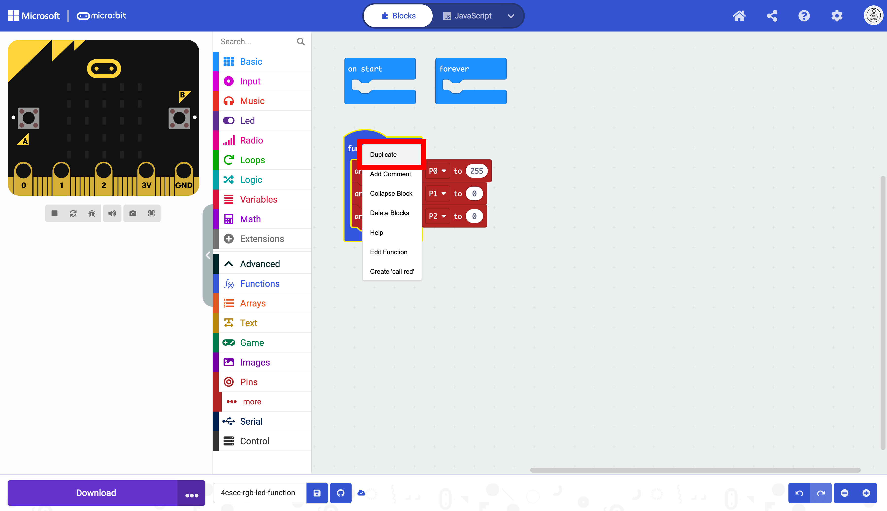

The `red` function duplicates will stack.

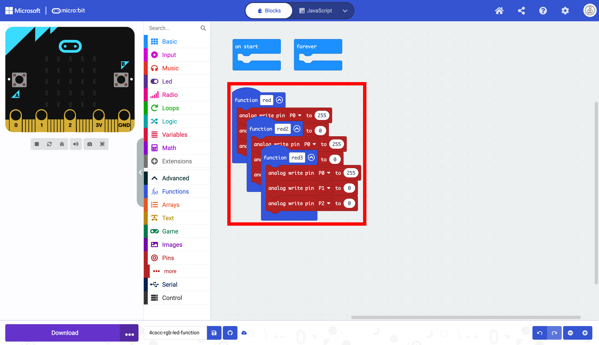

Rearrange the duplicated blocks.

The names of the `function` blocks and the values now must be changed.

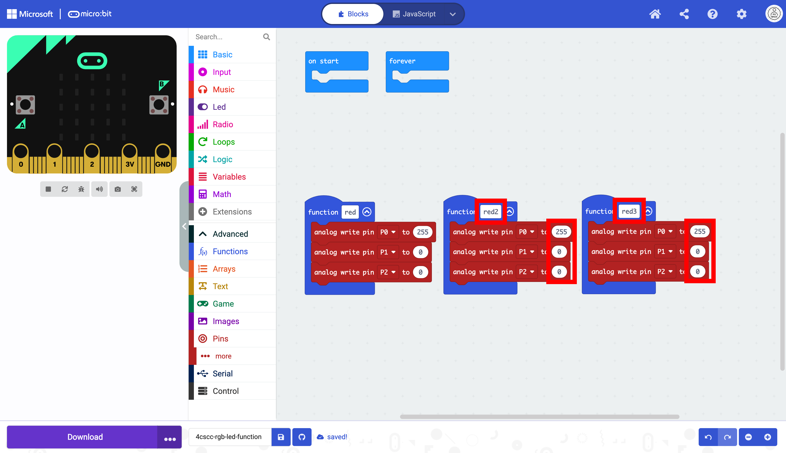

Change the names in the duplicated function boxes to green with green values (`0`, `255`, `0`) and blue with blue values (`0`, `0`, `255`).

Now that the functions have been defined, we need to call the functions. Click on the "Functions" drawer of the Toolbox. The function `call` blocks will appear here. 

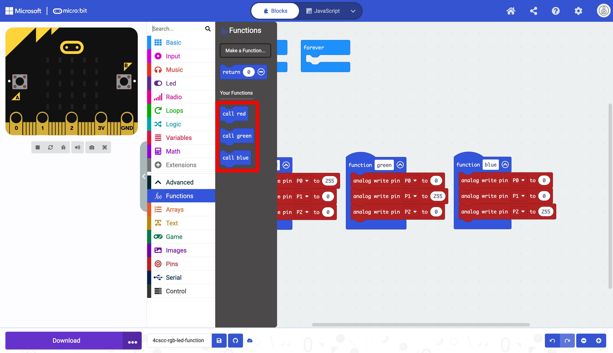

Drag the function `call` blocks to the `forever` block.

As in the previous section, you will add delays to control the duration that the color flashes. Click on the "Basic" drawer.

Select the `pause` block.

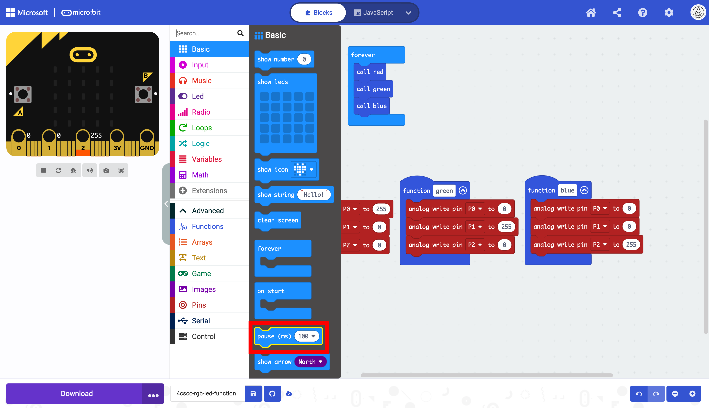

Place the `pause` block after the `call red` block. Change the duration for which red will stay on.

In this example, we will use `500` again, but feel free to experiment with the delay. 

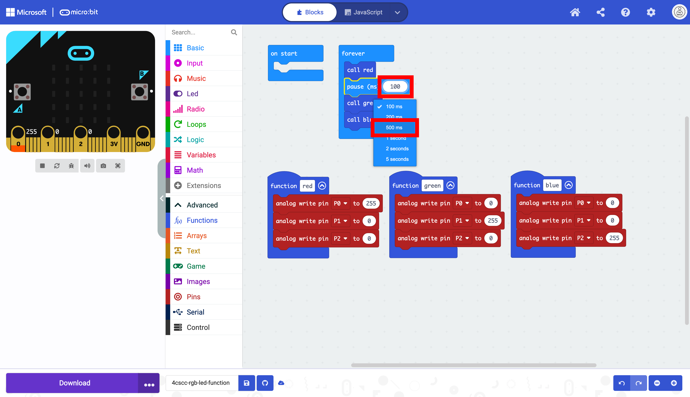

Duplicate the `pause` block twice.

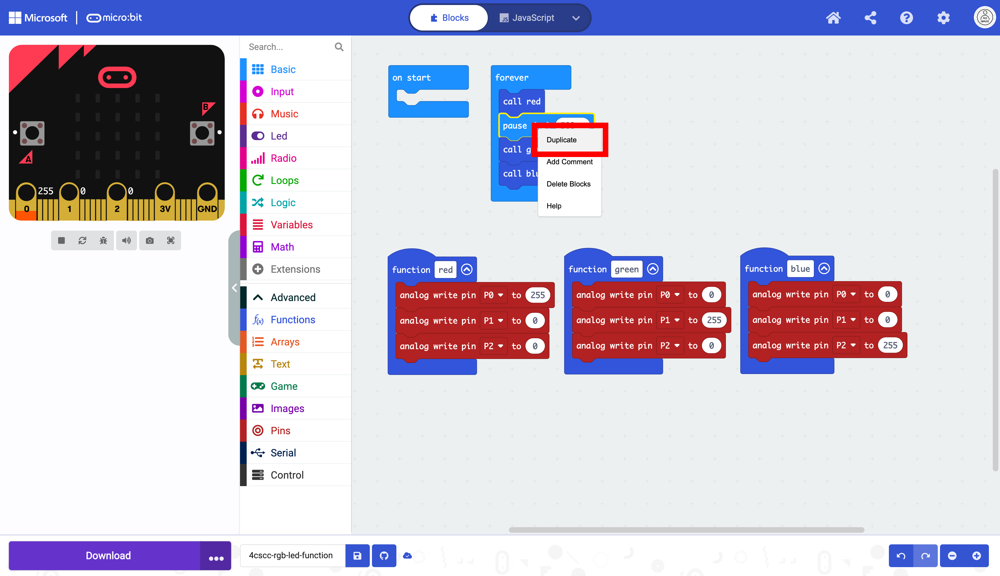

Place the duplicated `pause` blocks after the `call` boxed.

The program is now complete. The LED should alternate red, green, and blue every half a second using functions. Now that you have defined red, blue and green, you can call on these functions in future codes you write.
