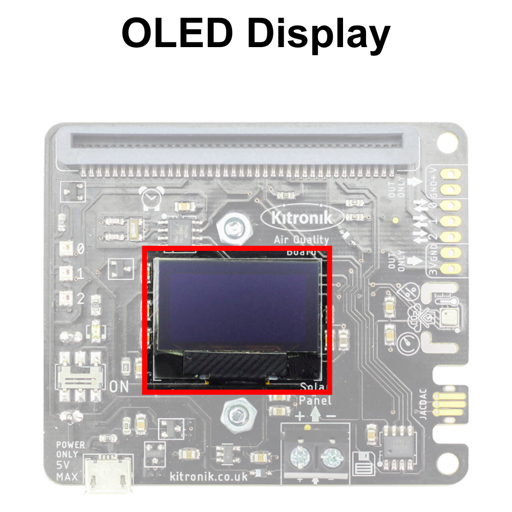
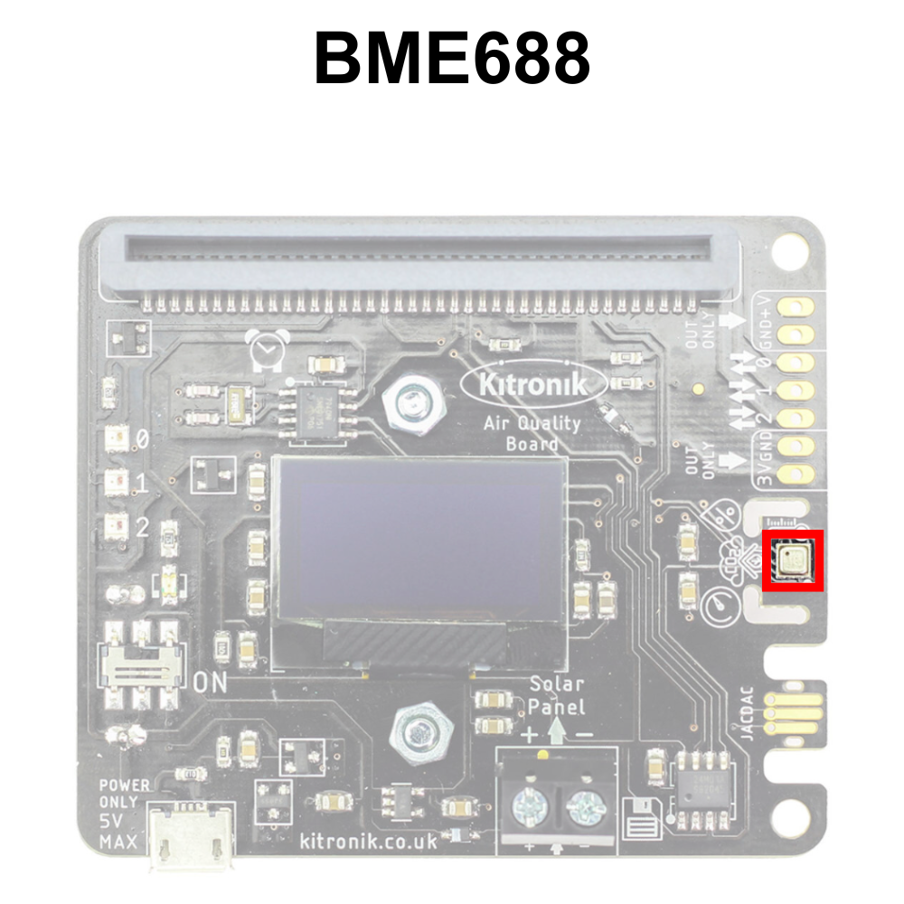
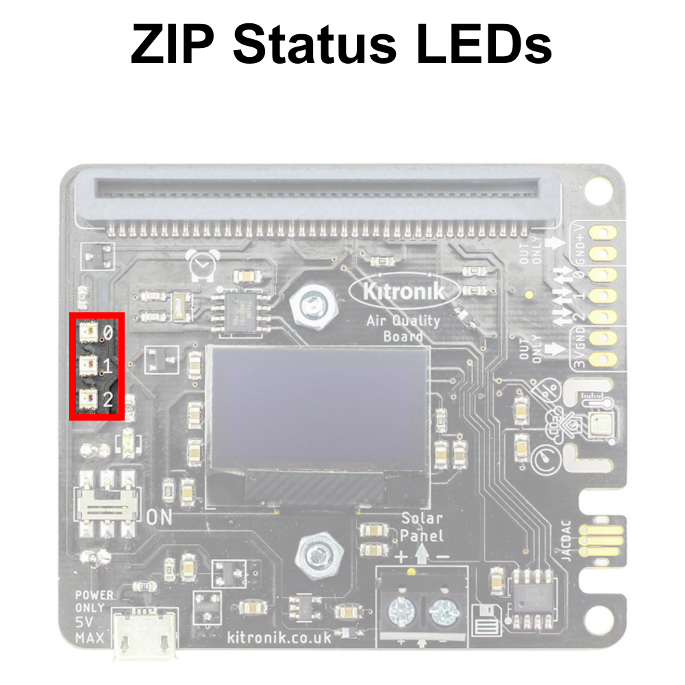
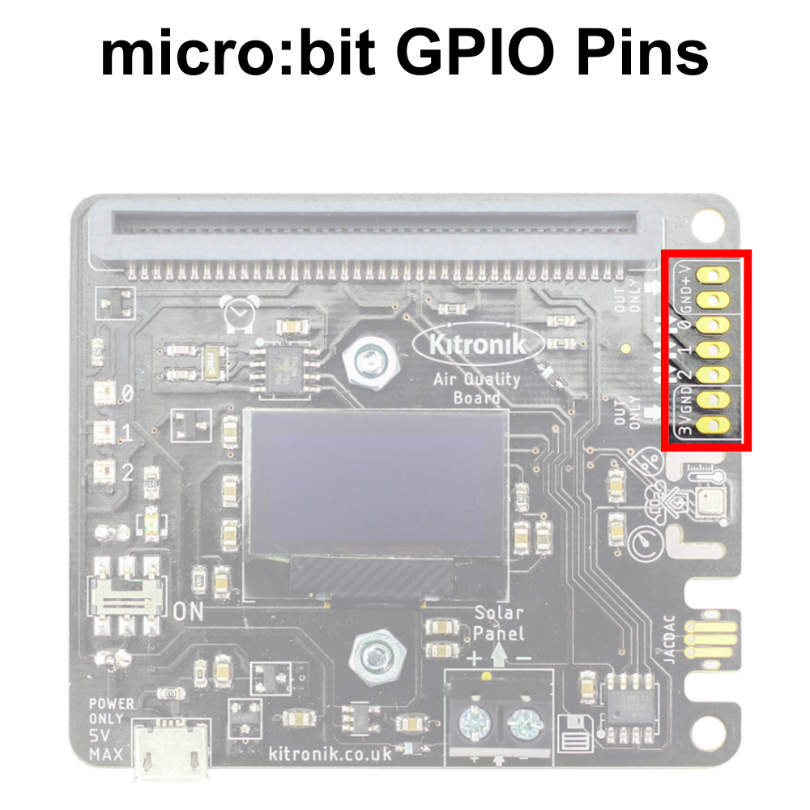
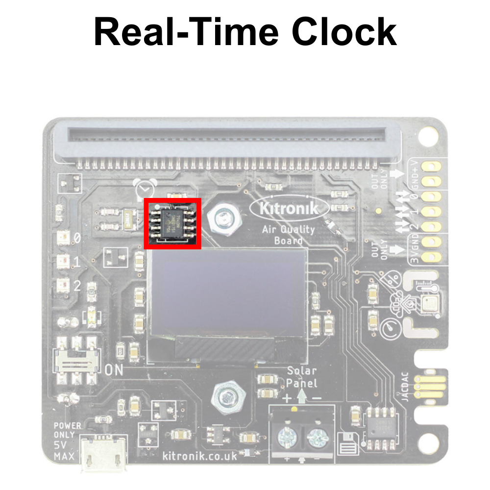
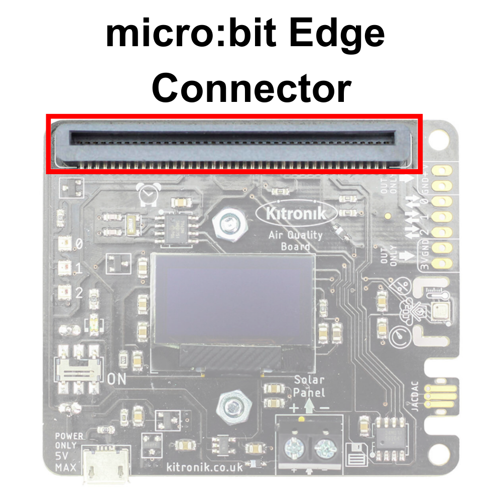
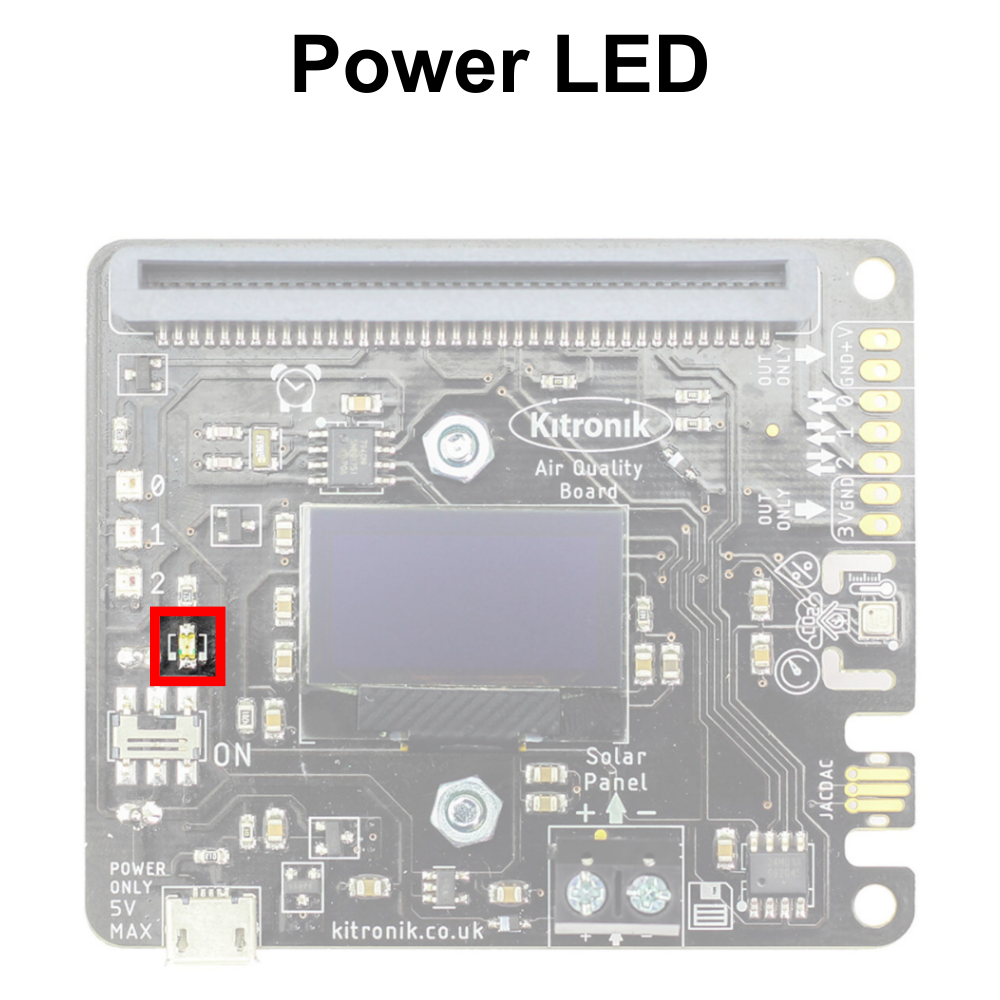
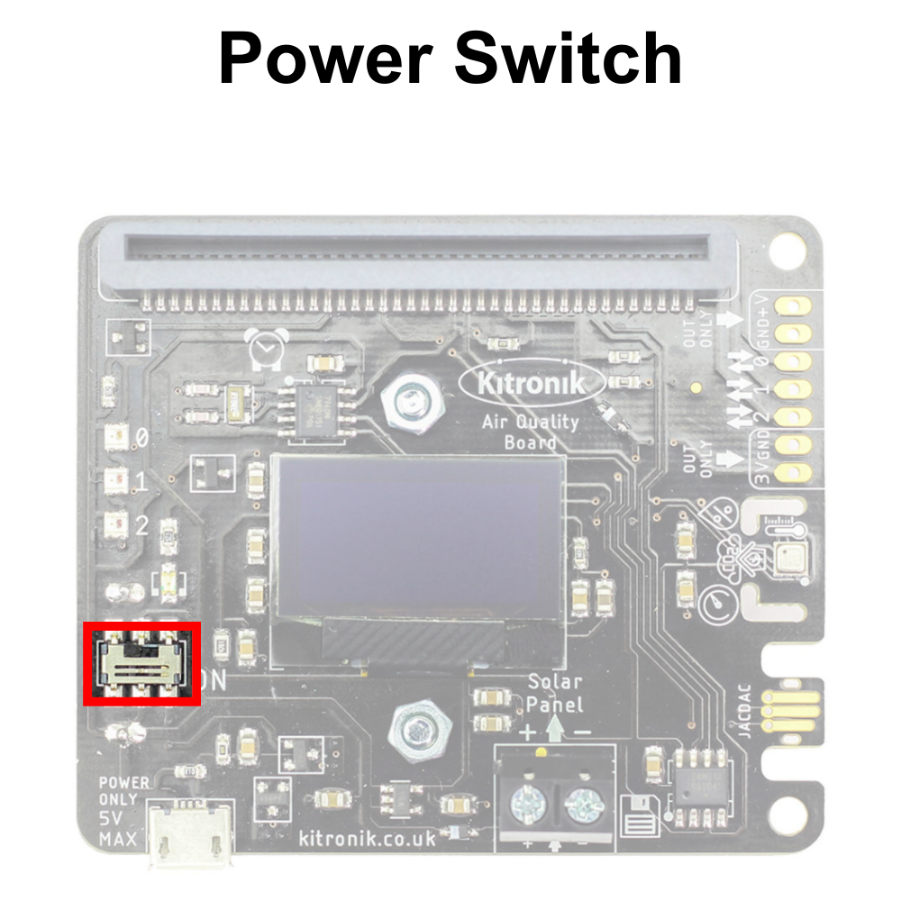
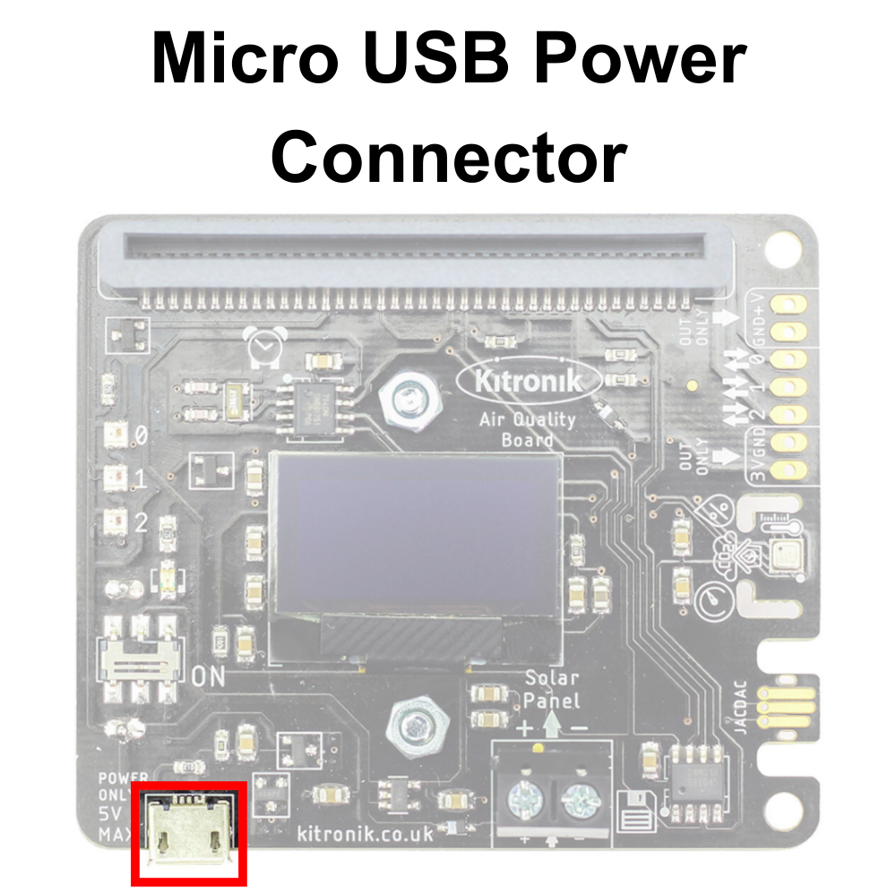
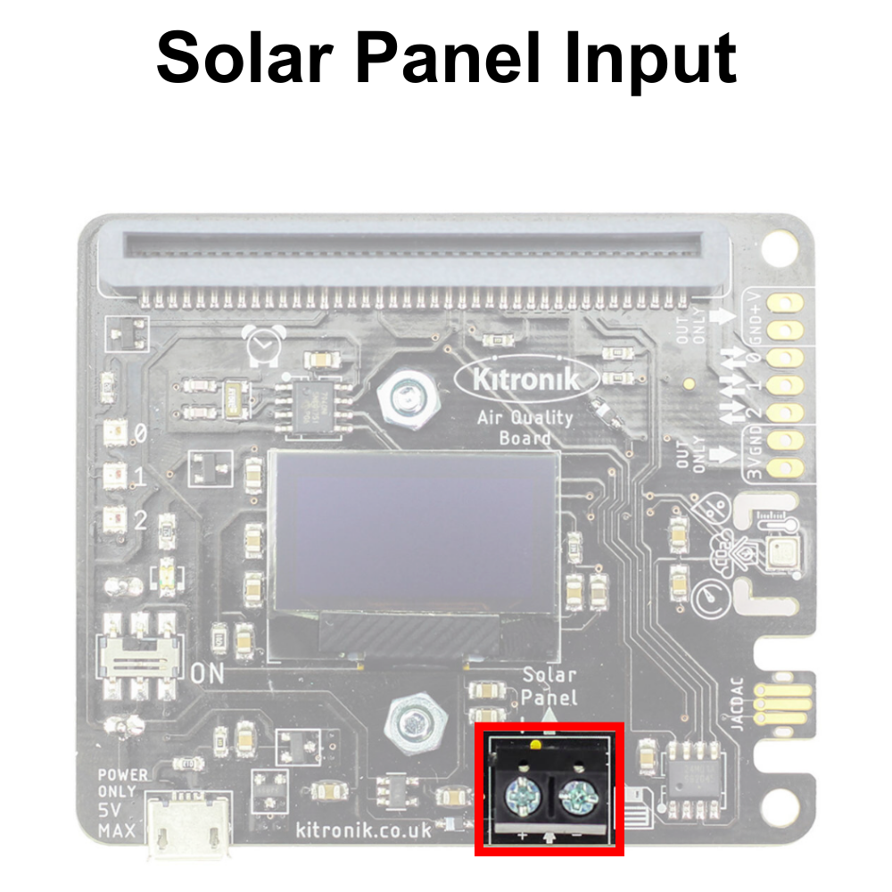

# Parts of the Kitronik Air Quality and Environmental Board

## Organic Light Emitting Diode (OLED) Display

The Kitronik Air Quality and Environmental Board has a 128×64 pixel Organic Light Emitting Diode (OLED) display. The OLED can be used to display information like numbers and words. It helps you see data from the sensors on the board, like air quality and temperature, in real-time.

## BME688

The Kitronik Air Quality and Environmental Board has a BME688 sensor to measure atmospheric data. The BME688 is a tiny sensor that can measure several important environmental factors all at once. It can check the temperature, humidity, air pressure, and even detect different gases in the air to help assess air quality. This sensor is very useful for projects where you want to monitor the environment around you, like checking the weather or seeing how clean the air is. It’s small enough to easily connect to devices like the micro:bit, making it perfect for science experiments and learning about how the world around us works.

## Zip Status LEDs

The Kitronik Air Quality and Environmental Board has three Zip Status LEDs are individually multicolored programmable LEDs that can be used in your projects. These LEDs can be used as status lights for sensors, change colors with different sensor values.

## micro:bit GPIO Pins

The Kitronik Air Quality and Environmental Board has access to GPIO pins 0, 1, and 2 on the micro:bit. These pins can be used to connect other analog or digital sensors that are not incluced on the Kitronik Air Quality and Environmental Board.

## Real-Time Clock

The Kitronik Air Quality and Environmental Board has a real-time clock (RTC). This is a special device that keeps track of the current time and date, even when the main power to a device is turned off. It works like a tiny, super-accurate watch inside your electronics. This is useful for things like setting alarms, keeping accurate logs of events, or any project where you need to know the exact time. An RTC is often used in computers, phones, and microcontroller projects to make sure they always know what time it is, no matter what happens.

## micro:bit Edge Connector 

The Kitronik Air Quality and Environmental Board has an micro:bit edge connector. This is where the micro:bit attatches to the board.

## Power LED

The power LED indicates that the power on the Kitronik Air Quality and Environmental Board. This is useful, as it lets you know that the unit is on and ready to run code from the micro:bit. It is also useful to see if the power is turned off before storing the board.

## Power Switch

The power switch allows you to turn off the Kitronik Air Quality and Environmental Board when it is not in use.

## Micro USB Connector

This conn

## Solar Penel Input

