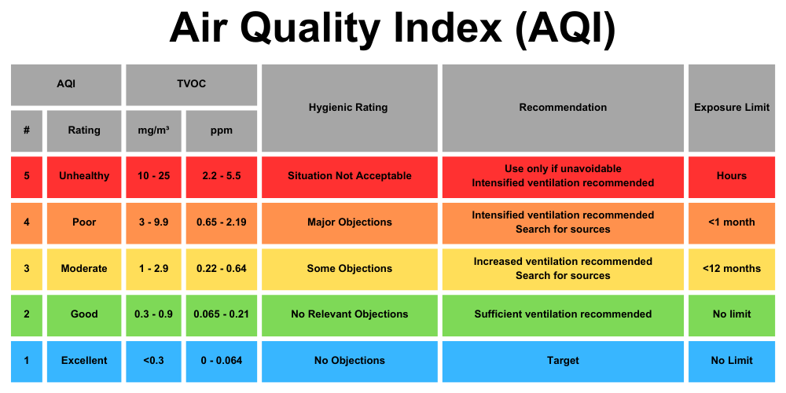

# Measuring the Air Quality Index (AQI)

## What is the AQI?

The Air Quality Index (AQI) is a way to measure how clean or polluted the air is in a specific place. It uses numbers and colors to show how safe the air is to breathe. Lower numbers mean the air is cleaner and healthier, while higher numbers mean there are more pollutants in the air that could be harmful, especially for people with breathing problems like asthma. The AQI helps us know when it's okay to be outside or if we should stay indoors to protect our health.

