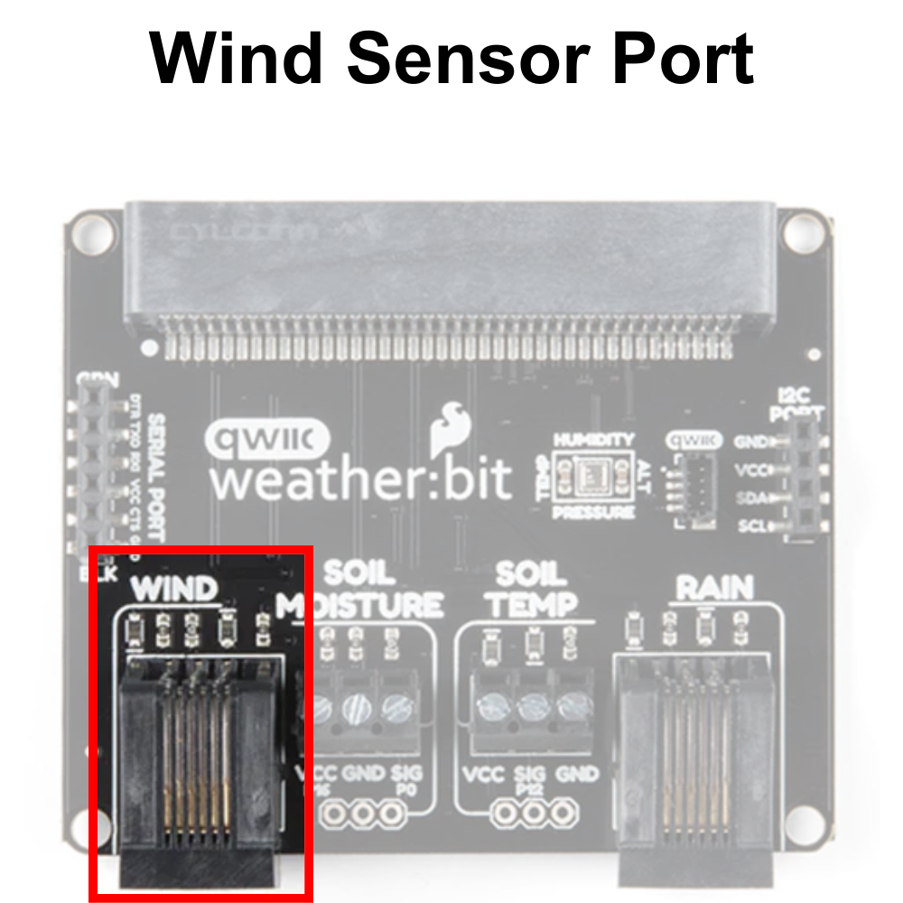

# Parts of the SparkFun weather:bit

## BME280

The SparkFun weather:bit board has a BME280 environmental sensor. The BME280 sensor is a small, advanced sensor that can measure temperature, humidity, and air pressure. It’s a tiny gadget that can fit in the palm of your hand, but it’s really powerful because it can give us accurate information about the environment around us. People use it in weather stations, smart homes, and even in phones to help predict the weather or make sure the conditions are just right for comfort. This sensor works by using special materials that respond to changes in temperature, humidity, and pressure, sending this data to a computer or another device, which can then display it in a way we can understand.

---

## Wind Sensor Port

The wind sensor port attaches to the **anemometer** and the wind vane.

---

## I2C Port

The I2C port will be used to attach the ELECFREAKS OLED display.

