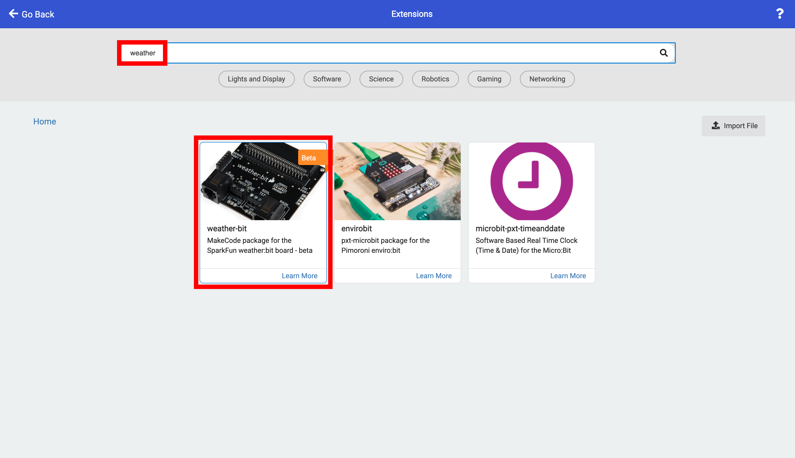
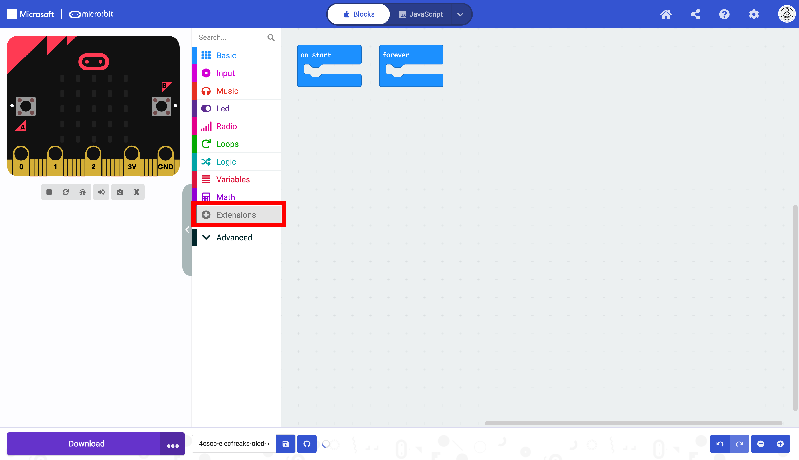
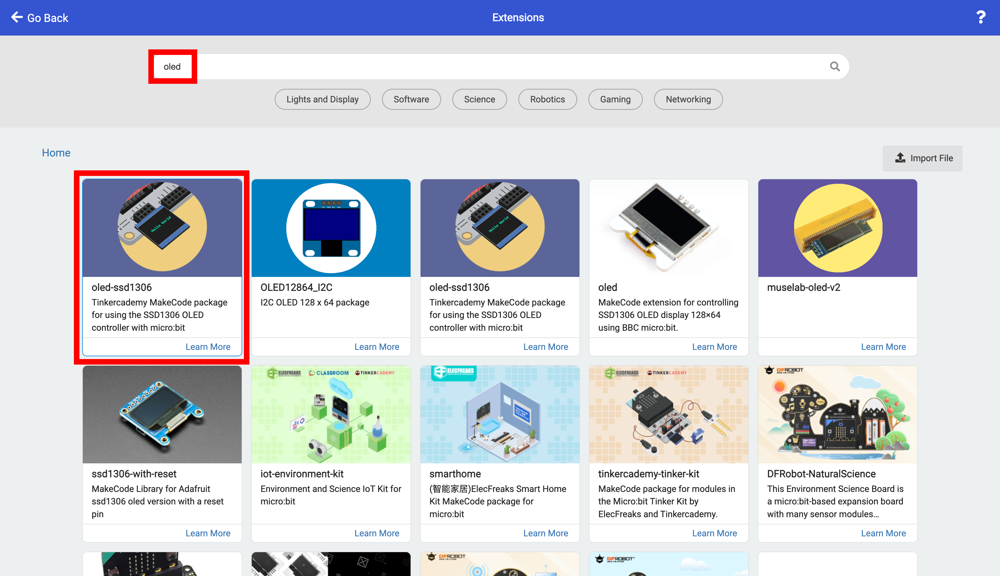
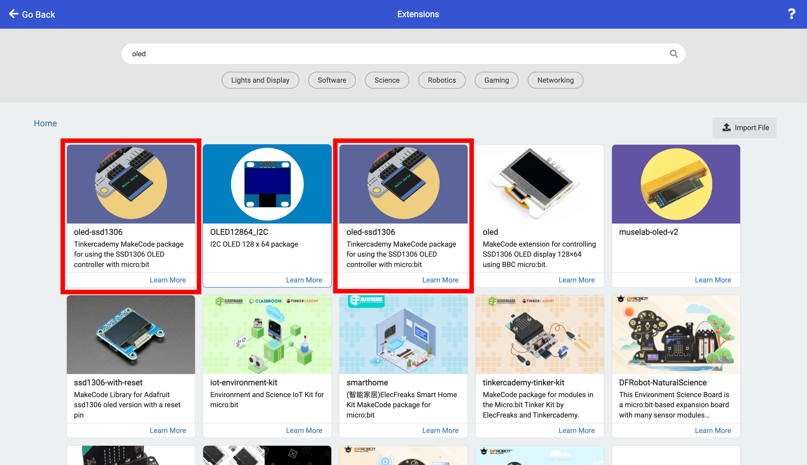
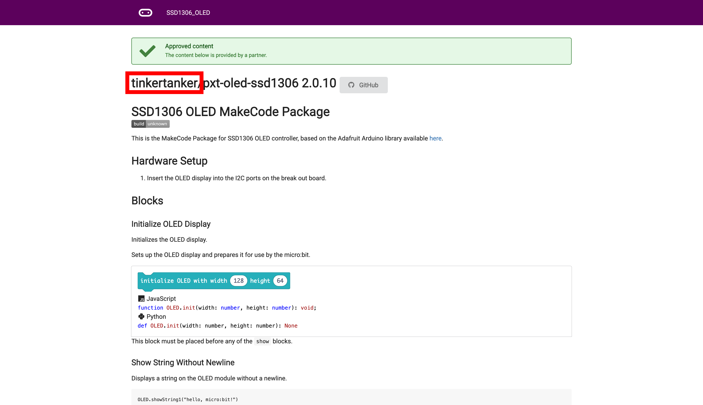

# Loading the Extensions

## Loading the SparkFun weather:bit Extension

You must first import the blocks necessary to operate the SparkFun weather:bit board.

Click on `Extensions` in the Toolbox.

A new window will open. Type "weather" in the search box. Select the weather:bit extension.

After you select the extension, the blocks are now available in MakeCode.

---

## Loading the ELECFREAKS I2C OLED Extension

Click on `Extensions` in the Toolbox.

A new window will open. Type "oled" in the search box. Select the first extension that has "Tinkeracademy" in the description. 

Note that there are two extensions that have "Tinkeracademy" in the description.

To make sure that the version used in this manual is selected. Click on "Learn More".

The documentation should have "Tinkeracademy" in the name.

After you select the extension, the blocks are now available in MakeCode.

A MakeCode link with both extensions preloaded can be opened [here](https://makecode.microbit.org/S32158-93017-54044-05128) (right-click and open in new window). Be sure to click on ‘edit code’ in the gray box in the upper right corner.

